# Linksoft.VideoSurveillance Architecture

A multi-assembly video surveillance platform supporting both a WPF desktop application and a headless REST API + Blazor Web UI, sharing a common Core library. Built on .NET 10.0 with in-process FFmpeg via Linksoft.VideoEngine.

## High-Level Architecture

## Assembly Dependency Graph

## Layered Architecture

## Video Pipeline Architecture

```mermaid
graph LR
    Camera["Camera<br/><i>RTSP/HTTP Stream</i>"]

    subgraph VideoEngine["Linksoft.VideoEngine"]
        Demuxer["Demuxer<br/><i>Packet extraction</i>"]
        Decoder["VideoDecoder<br/><i>CPU or D3D11VA</i>"]
        Remuxer["Remuxer<br/><i>Recording to file</i>"]
        Capture["FrameCapture<br/><i>PNG snapshots</i>"]
    end

    subgraph DirectX["VideoEngine.DirectX"]
        HwAccel["HwAccelContext<br/><i>D3D11VA device</i>"]
        VPR["VideoProcessorRenderer<br/><i>NV12 → BGRA</i>"]
        SCP["SwapChainPresenter<br/><i>DirectComposition</i>"]
    end

    subgraph WPF["Wpf.VideoPlayer"]
        VideoHost["VideoHost<br/><i>DComp Surface + Overlay</i>"]
    end

    Camera --> Demuxer
    Demuxer --> Decoder
    Decoder --> Remuxer
    Decoder --> Capture
    Decoder --> HwAccel
    HwAccel --> VPR
    VPR --> SCP
    SCP --> VideoHost
```

## OpenAPI-First API Design

## Real-Time Event Flow

## Assembly Responsibilities

### Core Layer

| Assembly | Target | Description |
|----------|--------|-------------|
| **Linksoft.VideoSurveillance.Core** | net10.0 | Shared domain library with zero UI dependencies. Contains all models (camera configuration, layouts, settings, overrides, recording entries), enums (ConnectionState, RecordingState, CameraProtocol, etc.), events (motion detected, recording state changed, connection changed), service interfaces (ICameraStorageService, IApplicationSettingsService, IRecordingService, IMotionDetectionService, ITimelapseService, IMediaCleanupService, etc.), helpers (ApplicationPaths, CameraUriHelper, RecordingPolicyHelper), and factories (DropDownItemsFactory). |

### Video Engine Layer

| Assembly | Target | Description |
|----------|--------|-------------|
| **Linksoft.VideoEngine** | net10.0 | Cross-platform video engine using in-process FFmpeg via Flyleaf.FFmpeg.Bindings. Provides `Demuxer` for packet extraction, `VideoDecoder` for CPU/GPU decoding, `Remuxer` for recording to file (MP4/MKV), `FrameCapture` for PNG snapshots, and `MediaProbe` for stream metadata. Exposes `IVideoPlayer` and `IVideoPlayerFactory` interfaces. Defines `IGpuAccelerator` for pluggable hardware acceleration. |
| **Linksoft.VideoEngine.DirectX** | net10.0-windows | Windows-specific GPU acceleration using Direct3D 11. Implements `IGpuAccelerator` via `D3D11Accelerator` for D3D11VA hardware-accelerated decoding. Provides `VideoProcessorRenderer` (NV12 to BGRA conversion), `SwapChainPresenter` (DirectComposition swap chain rendering), `HwAccelContext` (FFmpeg hardware device setup), and `GpuSnapshotCapture` (GPU-surface PNG capture). Uses Vortice bindings. |

### WPF Presentation Layer

| Assembly | Target | Description |
|----------|--------|-------------|
| **Linksoft.Wpf.VideoPlayer** | net10.0-windows | WPF `VideoHost` control that displays video via DirectComposition surface with XAML overlay support. Uses native window hierarchy (Surface Window + Overlay Window as WS_CHILD). Provides `OverlayBridge` for connecting WPF XAML elements to the native overlay window. |
| **Linksoft.Wpf.CameraWall** | net10.0-windows | Reusable WPF library (NuGet package) containing the complete camera wall implementation. Includes: `CameraWallManager` facade, service implementations (storage, settings, recording, motion detection, timelapse, media cleanup, segmentation, thumbnails, GitHub updates), 7+ dialog windows (CameraConfiguration, Settings, RecordingsBrowser, AssignCamera, CheckForUpdates, About, InputBox), 38+ dialog part UserControls for settings/configuration, camera grid and tile UserControls, motion bounding box overlay, and localization resources (en-US, da-DK, de-DE). |
| **Linksoft.Wpf.CameraWall.App** | net10.0-windows | Thin shell WPF application. Provides `MainWindow` with Fluent.Ribbon UI (Layouts, Cameras, View, Help tabs). Configures `Microsoft.Extensions.Hosting`, Serilog file logging (daily rolling, 7-day retention), and DI registration via `AddDependencyRegistrationsFromCameraWall()`. |

### Server Layer

| Assembly | Target | Description |
|----------|--------|-------------|
| **Linksoft.VideoSurveillance.Api.Contracts** | net10.0 | Auto-generated from `VideoSurveillance.yaml` via atc-rest-api-source-generator. Contains request/response DTOs, handler interfaces (IListCamerasHandler, ICreateCameraHandler, etc.), and error models. Shared contract between server and client. |
| **Linksoft.VideoSurveillance.Api.Domain** | net10.0 | Handler implementations for all API endpoints. 16 handlers covering Cameras CRUD (8), Layouts CRUD + Apply (5), Recordings (1), Settings (2). Includes mapping extensions for domain-to-DTO conversions. |
| **Linksoft.VideoSurveillance.Api** | net10.0 | ASP.NET Core host application. Registers all services (JsonCameraStorageService, JsonApplicationSettingsService, ServerRecordingService, ServerMotionDetectionService, VideoPlayerFactory, StreamingService). Configures CORS, SignalR hub at `/hubs/surveillance`, static file serving for HLS streams (`/streams`) and recordings (`/recordings-files`), OpenAPI docs via Scalar. Runs `CameraConnectionManager` and `SurveillanceEventBroadcaster` as hosted services. |

### Web UI

| Assembly | Target | Description |
|----------|--------|-------------|
| **Linksoft.VideoSurveillance.BlazorApp** | net10.0 | Blazor WebAssembly client with MudBlazor UI. Pages: Dashboard (live stats), Cameras (CRUD + snapshot/record), Layouts (drag-drop grid editor), Live View (HLS streaming with motion bounding boxes), Recordings (browse/playback/download), Settings (7-tab configuration). Uses `GatewayService` for API calls and `SurveillanceHubService` for SignalR real-time updates. Auto-generated API client from OpenAPI spec. |

### Orchestration

| Assembly | Target | Description |
|----------|--------|-------------|
| **Linksoft.VideoSurveillance.Aspire** | net10.0 | .NET Aspire AppHost for distributed orchestration. Starts the API on port 5000, then the BlazorApp with API service reference. Provides Aspire dashboard for monitoring, logs, traces, and health checks. |

### Testing

| Assembly | Target | Description |
|----------|--------|-------------|
| **Linksoft.VideoSurveillance.Core.Tests** | net10.0 | xUnit v3 unit tests for Core library. Tests models, enums, events, extensions, factories, and helpers. Uses AutoFixture, FluentAssertions, and NSubstitute. |
| **Linksoft.VideoEngine.Tests** | net10.0 | xUnit v3 unit tests for VideoEngine. Tests FFmpeg integration, video player, and frame capture. |
| **Linksoft.VideoSurveillance.Api.Tests** | net10.0 | xUnit v3 unit tests for API handlers and domain logic. Tests CRUD operations and mapping extensions. |

### Installer

| Assembly | SDK | Description |
|----------|-----|-------------|
| **Linksoft.VideoSurveillance.Installer** | WixToolset.Sdk 5.0.2 | WiX MSI installer for the desktop application. Auto-harvests published binaries via WiX Heat. Produces x64 Windows Installer package with Start Menu and Desktop shortcuts. Built via command line only (excluded from Visual Studio solution). |

## Key Technology Stack

| Component | Technology |
|-----------|------------|
| Framework | .NET 10.0 / C# 14.0 |
| Desktop UI | WPF with Fluent.Ribbon, Atc.Wpf.Controls |
| Web UI | Blazor WebAssembly with MudBlazor |
| Server | ASP.NET Core, SignalR |
| API Definition | OpenAPI 3.0 (atc-rest-api-source-generator) |
| Video Engine | Linksoft.VideoEngine (in-process FFmpeg via Flyleaf.FFmpeg.Bindings) |
| GPU Acceleration | Direct3D 11 (D3D11VA) via Vortice bindings |
| Rendering | DirectComposition swap chain |
| Orchestration | .NET Aspire |
| MVVM | Atc.XamlToolkit (source generators) |
| DI Registration | Atc.SourceGenerators (`[Registration]` attribute) |
| Theming | Atc.Wpf.Theming |
| Logging | Serilog (console + file sink) |
| Testing | xUnit v3, AutoFixture, FluentAssertions, NSubstitute |
| Versioning | Nerdbank.GitVersioning |
| Code Analysis | StyleCop, Meziantou, SonarAnalyzer, SecurityCodeScan |
| Installer | WiX Toolset v5 |

## Data Storage

Both the WPF app and the API server use the same JSON-based storage format under `%ProgramData%\Linksoft\CameraWall\`. The `ApplicationPaths` helper in Core provides default paths.

## Per-Camera Override System

Every application-level setting can be overridden on a per-camera basis. Override models use nullable properties where `null` means "use application default":

Override categories: Connection, CameraDisplay, Performance, Recording, MotionDetection (with nested BoundingBox).

## Service Registration

Services are auto-registered using `[Registration]` source-generated attributes:

- **WPF**: `services.AddDependencyRegistrationsFromCameraWall(includeReferencedAssemblies: true)` registers all services from the CameraWall library and referenced Core assembly.
- **API**: Explicit singleton registration in `Program.cs` for server-specific service implementations (JsonCameraStorageService, ServerRecordingService, etc.).
