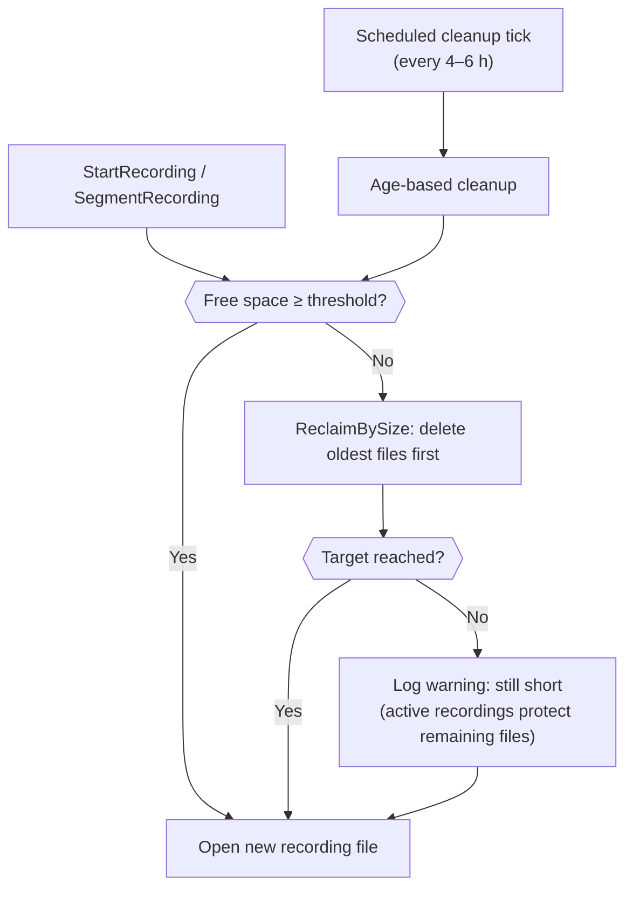

# 💾 Disk Space Guard

Automatic disk space management for recording deployments. When free space on the recording drive drops below a configurable threshold, the system deletes the oldest recordings first — keeping the most recent footage while ensuring space is always available for new recordings.

## 📖 Overview

The disk space guard runs on two triggers:

- **Write events** — checked synchronously before `StartRecording` and before each hourly segment rollover, so the drive is clear before any new file is opened.
- **Scheduled cleanup** — runs after every age-based cleanup pass as a secondary safety net for edge cases such as large timelapse bursts between recording events.

When free space is below the configured threshold, the guard enumerates all recording files under the recording root, sorts them oldest-first by last-write time, and deletes them one by one until the threshold is met or all non-active files are exhausted.



## 🗂️ Deletion Order

Files are deleted **oldest first** (ascending `LastWriteTime`, global across all camera folders under the recording root). Active recording files are never deleted — they are identified by their current file path and skipped even if they are the oldest files on disk.

Companion `.png` thumbnail files are deleted alongside their parent recording file.

This design preserves the most recent footage: when disk is tight, the oldest archive is sacrificed first.

## ⚙️ Settings Reference

### Media Cleanup Settings

| Setting | Type | Default | Description |
|---------|------|---------|-------------|
| `EnableDiskSpaceGuard` | bool | `true` | Enable the disk space guard. When disabled, no automatic reclaim runs — age-based cleanup continues unaffected. |
| `MinFreeSpaceMb` | int | `2048` | Minimum free disk space to maintain on the recording drive (in MB). The guard fires whenever available space drops below this value. |

Both settings live under `Recording.Cleanup` in `settings.json` and are exposed in the **Settings → Recording → Media Cleanup** tab.

### Threshold Sizing Guide

| Threshold | Suitable for | Notes |
|-----------|--------------|-------|
| 500 MB | Motion-only, low frame rate | Not recommended for 24/7 multi-camera — at 150 MB/min a short gap blows past it |
| 1 GB | 1 camera 24/7, or 3 cameras motion-only | Borderline |
| **2 GB** | **2–3 cameras 24/7** | **~13 min buffer at 150 MB/min — recommended default** |
| 5 GB | 3–8 cameras 24/7 | Comfortable |
| 10 GB | Large multi-camera / high-bitrate | Conservative |
| 20 GB | Enterprise 24/7 | Maximum safety |

## 🖥️ Setup: WPF Desktop App

### 1. Enable the Guard

Open **Settings** (View tab) → **Recording** → **Media Cleanup**:

- Toggle **Enable Disk Space Guard** on (enabled by default).
- Set **Minimum Free Space** from the dropdown (2 GB is recommended for 24/7 deployments).

### 2. Pair With Scheduled Cleanup

For best results, enable a cleanup schedule in the same tab so age-based pruning also runs periodically. The disk space guard then acts as a live floor — the scheduled pass handles routine archive management, and the guard catches any surprise spikes between ticks.

### 3. Configure Recording Segmentation

Hourly segmentation (`Recording → Segmentation`) is strongly recommended with 24/7 recording. Each rollover is a reclaim opportunity — the guard runs before every new segment is opened, so disk pressure is addressed continuously rather than only at recording start.

## 🌍 Setup: REST API Server

### Configure via the Settings Endpoint

```http
PUT /settings
Content-Type: application/json

{
  "recording": {
    "cleanup": {
      "schedule": "onStartupAndPeriodically",
      "recordingRetentionDays": 30,
      "enableDiskSpaceGuard": true,
      "minFreeSpaceMb": 2048
    }
  }
}
```

### Monitor Disk Space via `/health/recordings`

The health endpoint exposes a `DiskSpaceLow` flag at both the summary level and per active session:

```http
GET /health/recordings
```

```json
{
  "uptimeSeconds": 86400,
  "activeRecordings": 3,
  "stuckRecordings": 0,
  "diskSpaceLow": false,
  "sessions": [
    {
      "cameraId": "...",
      "cameraName": "Front Door",
      "filePath": "/recordings/front-door/2026-06-18T14-00-00.mkv",
      "startedAtUtc": "2026-06-18T14:00:00Z",
      "durationSeconds": 3541,
      "isPipelineActive": true,
      "diskSpaceLow": false
    }
  ]
}
```

`diskSpaceLow` is `true` when `AvailableFreeSpace < MinFreeSpaceMb` at the time of the request. This flag is suitable for use in monitoring scripts, alerting pipelines, and soak-test dashboards.

## 📋 Log Messages

All reclaim activity is logged via structured `[LoggerMessage]` entries. Filter by these messages to audit guard activity:

| Level | Message | Meaning |
|-------|---------|---------|
| Debug | `Disk space OK on {Drive}: {FreeMb} MB free` | Drive is above threshold — no action taken |
| Warning | `Disk space low on {Drive}: {FreeMb} MB free (threshold {ThresholdMb} MB) — starting reclaim pass` | Guard triggered; oldest-file deletion begins |
| Error | `Disk space critically low on {Drive}: {FreeMb} MB — reclaim could not reach target` | All non-active files exhausted; active recordings still consuming space |
| Information | `Disk space reclaim: freed {FreedMb} MB ({Count} files)` | Reclaim completed successfully |
| Warning | `Disk space reclaim exhausted all non-active recordings; still {ShortMb} MB short of target` | Guard ran out of eligible files before meeting the threshold |

## 🔧 Troubleshooting

### Disk fills up despite the guard being enabled

- **Cause**: Write rate exceeds the reclaim rate — cameras produce more data per segment than the guard can recover from older files.
- **Solutions**:
  - Increase `MinFreeSpaceMb` so reclaim triggers earlier, with more headroom.
  - Enable hourly segmentation — more frequent reclaim opportunities.
  - Reduce recording bitrate or resolution in camera settings.
  - Reduce `RecordingRetentionDays` so age-based cleanup removes files faster.

### Warning: "disk space reclaim exhausted all non-active recordings; still X MB short"

- **Cause**: All deletable recordings have been removed, but active cameras are still recording and consuming the remaining space. The guard cannot delete files currently being written.
- **Behavior**: The system continues recording. FFmpeg will close the muxer gracefully if the OS returns a disk-full error; the pipeline error surfaces through the normal connection state handling.
- **Solutions**:
  - Add more disk space.
  - Reduce the number of simultaneously recording cameras.
  - Reduce recording bitrate or enable motion-only recording.

### Guard triggers too frequently

- **Cause**: `MinFreeSpaceMb` is set close to the typical free-space level, causing near-continuous reclaim passes.
- **Solution**: Lower `MinFreeSpaceMb` to a value that still provides a comfortable buffer but is well below steady-state free space, or increase total disk capacity.

### Old recordings not being deleted

- **Cause**: All recordings visible on disk belong to active sessions (i.e., every file is currently being written).
- **Check**: Review the `/health/recordings` endpoint — if `diskSpaceLow` is `true` and `activeRecordings` equals the total file count, all files are protected by active sessions.
- **Solution**: Stop one or more recordings, or wait for segment rollover (the rolled-off segment immediately becomes eligible).
