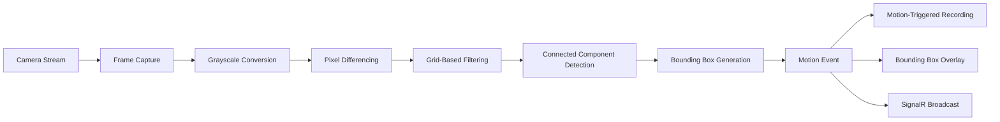
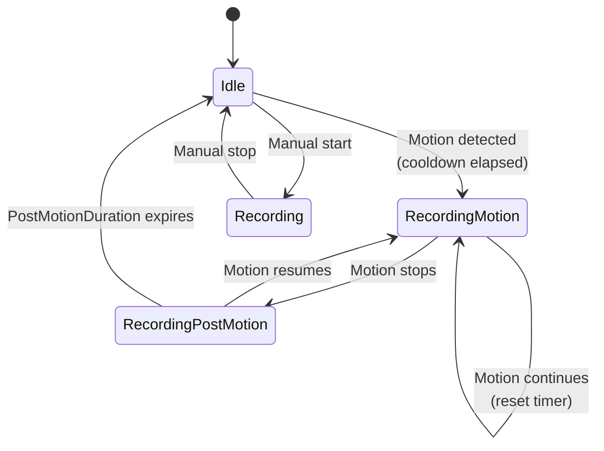

# Motion Detection Guide

Setup and configuration guide for the motion detection system in Linksoft.VideoSurveillance. Covers both the WPF desktop app and the REST API server.

## Overview

The motion detection system uses frame-based pixel differencing to detect movement in camera streams. It supports multiple simultaneous motion regions with bounding box visualization, motion-triggered recording, and real-time event broadcasting via SignalR.



## Detection Algorithm

### Step 1: Frame Capture

Frames are captured from the camera's media pipeline at the configured `AnalysisFrameRate`. The scheduler uses round-robin across all cameras to prevent CPU spikes.

### Step 2: Grayscale Conversion and Downscaling

Each frame is converted to grayscale using the luminosity formula and downscaled to the configured analysis resolution (`AnalysisWidth` x `AnalysisHeight`):

```
Gray = (77 * R + 150 * G + 29 * B) >> 8
```

Lower analysis resolution reduces CPU usage at the cost of detection accuracy.

### Step 3: Pixel Differencing

Each pixel is compared with the corresponding pixel from the previous frame. The difference threshold is derived from the `Sensitivity` setting:

```
Threshold = 35 - (Sensitivity * 0.2)
```

| Sensitivity | Threshold | Behavior |
|-------------|-----------|----------|
| 0 | 35 | Requires large pixel changes |
| 30 (default) | 29 | Balanced detection |
| 50 | 25 | Moderately sensitive |
| 100 | 15 | Detects subtle changes |

Pixels with differences exceeding the threshold are marked as "changed".

### Step 4: Grid-Based Noise Filtering

The frame is divided into a grid of 20x20 pixel cells. Each cell counts its changed pixels. Only cells with at least 8% changed pixels (minimum 32 pixels per 400-pixel cell) are marked as "active". This filters out scattered sensor noise.

### Step 5: Connected Component Detection

A flood fill algorithm identifies connected clusters of active cells using 8-connectivity (including diagonals). Each cluster represents a distinct motion region.

### Step 6: Bounding Box Generation

Bounding boxes are created for clusters exceeding the `MinArea` threshold. The configured `Padding` is added around each box. Boxes are sorted by area (largest first) and limited to a maximum of 10 per frame.

### Step 7: Motion Decision

The total change percentage is compared against `MinimumChangePercent`:
- If `changePercent >= MinimumChangePercent` → **Motion Active**
- Otherwise → **Motion Inactive**

## CPU Scheduling

The scheduler prevents CPU spikes when monitoring multiple cameras:

- **Round-robin**: Analyzes one camera per timer tick
- **Dynamic interval**: `interval = 1000ms / (numberOfCameras * maxFrameRate)`
- **Constraints**: Min 16ms (~60 Hz ceiling), Max 500ms, frame rate clamped 2-15 fps
- **Skip rule**: If the previous frame is still being analyzed, the camera is skipped

| Cameras | Max FPS | Analyses/sec | Timer Interval |
|---------|---------|-------------|----------------|
| 1 | 5 | 5 | 200ms |
| 4 | 5 | 20 | 50ms |
| 8 | 3 | 24 | ~42ms |
| 16 | 2 | 32 | ~31ms |

## Settings Reference

### Analysis Settings

| Setting | Type | Default | Range | Description |
|---------|------|---------|-------|-------------|
| `Sensitivity` | int | `30` | 0-100 | Detection threshold. Higher values detect more subtle motion. |
| `MinimumChangePercent` | double | `0.5` | 0.0-100.0 | Minimum percentage of frame pixels that must change. |
| `AnalysisFrameRate` | int | `30` | 1-30 | Target FPS for analysis (internally clamped to 2-15). |
| `AnalysisWidth` | int | `800` | - | Width of downscaled analysis frame. |
| `AnalysisHeight` | int | `600` | - | Height of downscaled analysis frame. |
| `PostMotionDurationSeconds` | int | `10` | 1-300 | Seconds to continue reporting motion after it stops. |
| `CooldownSeconds` | int | `5` | 0-60 | Minimum seconds between motion-triggered recordings. |

### Analysis Resolution Presets

| Preset | Resolution | CPU Impact | Use Case |
|--------|-----------|------------|----------|
| Low | 320x240 | Minimal | Many cameras, basic detection |
| Balanced | 480x360 | Low | General purpose |
| Standard | 640x480 | Moderate | Good detection accuracy |
| High | 800x600 | High | High accuracy (default) |
| Very High | 960x720 | Very High | Maximum accuracy |

### Bounding Box Settings

| Setting | Type | Default | Range | Description |
|---------|------|---------|-------|-------------|
| `ShowInGrid` | bool | `false` | - | Display boxes in camera grid view. |
| `ShowInFullScreen` | bool | `false` | - | Display boxes in full-screen view. |
| `Color` | string | `"Red"` | - | Box border color (named color). |
| `Thickness` | int | `2` | 1-10 | Line thickness in pixels. |
| `MinArea` | int | `10` | - | Minimum area to display a box (filters noise). |
| `Padding` | int | `4` | - | Padding around detected regions in pixels. |
| `Smoothing` | double | `0.3` | 0.0-1.0 | Smoothing factor for box position transitions. |

### Smoothing Behavior

The smoothing factor uses linear interpolation between frames to reduce jitter:

```
alpha = 1.0 - SmoothingFactor
smoothed.Position = Lerp(previous.Position, current.Position, alpha)
```

| Smoothing | Behavior |
|-----------|----------|
| 0.0 | No smoothing, boxes jump to exact positions |
| 0.3 | Moderate smoothing (default), natural movement |
| 0.7 | Heavy smoothing, slow transitions |
| 1.0 | Maximum smoothing, boxes barely move |

## Motion-Triggered Recording



### Recording States

| State | Description |
|-------|-------------|
| `Idle` | Not recording |
| `Recording` | Manual recording (takes priority over motion) |
| `RecordingMotion` | Recording triggered by motion detection |
| `RecordingPostMotion` | Motion stopped, recording continues for PostMotionDurationSeconds |

### Recording Flow

1. **Motion detected**: If `EnableRecordingOnMotion` is enabled and cooldown has elapsed, recording starts in `RecordingMotion` state.
2. **Motion continues**: Each motion event resets the post-motion timer.
3. **Motion stops**: Transitions to `RecordingPostMotion`. A timer counts down `PostMotionDurationSeconds`.
4. **Timer expires**: If no new motion occurs, recording stops and returns to `Idle`.
5. **Motion resumes**: If motion is detected during post-motion countdown, returns to `RecordingMotion` and timer resets.

### Cooldown

The `CooldownSeconds` setting prevents rapid recording cycles. After a motion-triggered recording ends, new motion events are ignored for the cooldown period.

### Manual Recording Priority

If a user starts manual recording, it takes priority. Motion events are still processed (bounding boxes still display) but cannot start or stop a manual recording.

## Setup: WPF Desktop App

### 1. Configure Global Motion Detection Settings

Open **Settings** (View tab) and navigate to the **Motion Detection** tab:

- Set **Sensitivity** (start with 30, increase if motion is missed, decrease if false positives)
- Set **Analysis Resolution** (lower for more cameras, higher for better accuracy)
- Set **Post-Motion Duration** (how long to keep recording after motion stops)
- Set **Cooldown** (minimum gap between recordings)

### 2. Configure Bounding Box Display

In the same **Motion Detection** tab, under **Bounding Box** section:

- Enable **Show in Grid** and/or **Show in Full Screen**
- Choose a **Color** (Red is recommended for visibility)
- Set **Thickness** (2-3 pixels typical)
- Set **Min Area** (increase to filter small noise)
- Adjust **Smoothing** (0.3 is a good starting point)

### 3. Enable Motion-Triggered Recording

Navigate to the **Recording** tab in Settings:

- Enable **Record on Motion Detection**
- Configure **Recording Path** and **Recording Format**
- Optionally enable **Hourly Segmentation** for manageable file sizes

### 4. Per-Camera Overrides (Optional)

Right-click a camera tile → **Edit** → navigate to the **Motion Detection** overrides tab:

- Toggle individual settings to **Override Locally**
- Useful for cameras in high-traffic areas (lower sensitivity) or quiet areas (higher sensitivity)

### 5. Verify Detection

- Watch for bounding boxes appearing on camera tiles (if enabled)
- Check the recording indicator when motion triggers recording
- Use the **Recordings Browser** (View tab) to review motion-triggered recordings

## Setup: REST API Server

### 1. Configure Settings via API

```http
PUT /settings
Content-Type: application/json

{
  "motionDetection": {
    "sensitivity": 30,
    "minimumChangePercent": 0.5,
    "analysisFrameRate": 5,
    "analysisWidth": 640,
    "analysisHeight": 480,
    "postMotionDurationSeconds": 10,
    "cooldownSeconds": 5,
    "boundingBox": {
      "showInGrid": true,
      "color": "Red",
      "thickness": 2,
      "minArea": 25
    }
  },
  "recording": {
    "enableRecordingOnMotion": true,
    "recordingFormat": "mkv"
  }
}
```

### 2. Per-Camera Overrides via API

```http
PUT /cameras/{cameraId}
Content-Type: application/json

{
  "overrides": {
    "motionDetection": {
      "sensitivity": 50,
      "analysisWidth": 320,
      "analysisHeight": 240,
      "boundingBox": {
        "color": "Green"
      }
    }
  }
}
```

### 3. Monitor Events via SignalR

Connect to the SignalR hub at `/hubs/surveillance` and subscribe to events:

```javascript
const connection = new signalR.HubConnectionBuilder()
    .withUrl("http://localhost:5000/hubs/surveillance")
    .withAutomaticReconnect()
    .build();

// Motion detection events
connection.on("MotionDetected", (event) => {
    console.log(`Camera ${event.cameraId}: motion=${event.isMotionActive}`);
    console.log(`Change: ${event.changePercentage}%`);
    console.log(`Boxes: ${event.boundingBoxes.length}`);
    // event.boundingBoxes: [{ x, y, width, height }]
    // event.analysisWidth, event.analysisHeight for coordinate mapping
});

// Recording state changes (triggered by motion)
connection.on("RecordingStateChanged", (event) => {
    console.log(`Camera ${event.cameraId}: ${event.oldState} → ${event.newState}`);
    if (event.filePath) console.log(`File: ${event.filePath}`);
});

await connection.start();
```

### SignalR Events

| Event | Payload | Description |
|-------|---------|-------------|
| `MotionDetected` | `{ CameraId, IsMotionActive, ChangePercentage, BoundingBoxes[], AnalysisWidth, AnalysisHeight, Timestamp }` | Fired when motion state changes or bounding boxes update |
| `RecordingStateChanged` | `{ CameraId, NewState, OldState, FilePath }` | Fired when recording starts/stops (including motion-triggered) |
| `ConnectionStateChanged` | `{ CameraId, NewState, Timestamp }` | Fired when camera connection state changes |

### Bounding Box Coordinate Mapping

Bounding box coordinates are relative to the analysis resolution. To map to actual video or display dimensions:

```
displayX = (box.X / analysisWidth) * displayWidth
displayY = (box.Y / analysisHeight) * displayHeight
displayW = (box.Width / analysisWidth) * displayWidth
displayH = (box.Height / analysisHeight) * displayHeight
```

## Performance Tuning

### Reducing CPU Usage

| Strategy | Setting | Impact |
|----------|---------|--------|
| Lower frame rate | `AnalysisFrameRate: 2-4` | Major reduction, slight delay in detection |
| Lower resolution | `AnalysisWidth/Height: 320x240` | Major reduction, may miss small motion |
| Increase sensitivity threshold | `Sensitivity: 10-20` | Fewer false positives, less processing |
| Increase minimum change | `MinimumChangePercent: 1.0-2.0` | Ignores minor motion |

### Memory Usage Per Camera

| Resolution | Buffer Size | Suitable For |
|-----------|-------------|--------------|
| 320x240 | ~76 KB | Many cameras (16+) |
| 480x360 | ~170 KB | Medium deployments (8-16) |
| 640x480 | ~300 KB | Standard deployments (4-8) |
| 800x600 | ~480 KB | Few cameras (1-4) |

### Recommended Configurations

**Low-resource server (many cameras)**:
```json
{
  "analysisFrameRate": 2,
  "analysisWidth": 320,
  "analysisHeight": 240,
  "sensitivity": 20,
  "minimumChangePercent": 1.0
}
```

**Balanced (general purpose)**:
```json
{
  "analysisFrameRate": 5,
  "analysisWidth": 640,
  "analysisHeight": 480,
  "sensitivity": 30,
  "minimumChangePercent": 0.5
}
```

**High accuracy (few cameras, security-critical)**:
```json
{
  "analysisFrameRate": 10,
  "analysisWidth": 800,
  "analysisHeight": 600,
  "sensitivity": 50,
  "minimumChangePercent": 0.3
}
```

## Troubleshooting

### False Positives

- **Symptom**: Motion detected when nothing is moving.
- **Causes**: Lighting changes, camera noise, wind-blown objects.
- **Solutions**:
  - Decrease `Sensitivity` (try 15-20)
  - Increase `MinimumChangePercent` (try 1.0-2.0)
  - Increase `MinArea` bounding box setting (try 50-100)
  - Lower `AnalysisFrameRate` (fewer comparisons = fewer false triggers)

### Missed Motion

- **Symptom**: Objects move but motion is not detected.
- **Causes**: Sensitivity too low, resolution too low, objects too small.
- **Solutions**:
  - Increase `Sensitivity` (try 50-70)
  - Decrease `MinimumChangePercent` (try 0.2-0.3)
  - Increase analysis resolution
  - Decrease `MinArea` bounding box setting

### High CPU Usage

- **Symptom**: CPU usage spikes with motion detection enabled.
- **Solutions**:
  - Reduce `AnalysisFrameRate` to 2-4 fps
  - Reduce analysis resolution to 320x240 or 480x360
  - Use per-camera overrides to lower settings on less important cameras

### Recording Gaps

- **Symptom**: Gaps between motion-triggered recordings.
- **Causes**: Cooldown too long, post-motion too short.
- **Solutions**:
  - Reduce `CooldownSeconds` (try 2-3)
  - Increase `PostMotionDurationSeconds` (try 15-30)
