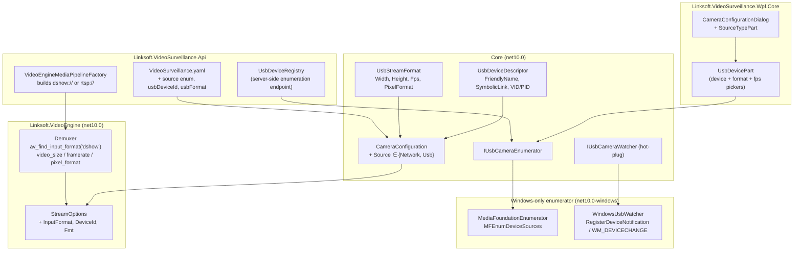

# 🎥 USB Camera Support Roadmap

End-to-end plan for adding USB / DirectShow / UVC webcam support to **`Linksoft.CameraWall.Wpf.App`** (standalone), **`Linksoft.VideoSurveillance.Api`** (server) and **`Linksoft.VideoSurveillance.Wpf.App`** (API client). Test-first across every layer; UI redesign of the camera dialog so RTSP and USB feel like first-class siblings.

---

## 🗂️ Status Legend

| Emoji | Meaning |
|-------|---------|
| ⬜ | Not started |
| 🟦 | Planned (queued for the next iteration) |
| 🟨 | In progress |
| ✅ | Complete |
| 🧪 | Test scaffolding only (red — no production code yet) |
| 🟩 | Test scaffolding green (production code passes the tests) |
| ⏸️ | Deferred (intentionally not in current scope) |
| ❌ | Cancelled / dropped |

Update this column on every PR that touches the roadmap.

---

## 🎯 Vision & Motivation

Today every camera in the platform is an IP camera — `CameraConfiguration` is hard-wired around `IpAddress`, `Port`, `Protocol ∈ { Rtsp, Http, Https }` and `BuildUri()` produces an `rtsp://` / `http://` URL that FFmpeg auto-detects.

USB cameras are fundamentally different:

- They have **no IP / port / URL** — only a friendly name + device moniker / symbolic link.
- They are **enumerated**, not configured. The user picks one from a list of present devices.
- They are **single-tenant** — once one process opens the device, others fail.
- They are **hot-pluggable** — they appear and disappear at runtime.
- They expose **discrete capabilities** (resolution × framerate × pixel-format triples), not a continuous parameter space.
- On Windows they are accessed via FFmpeg's `dshow` input format (DirectShow); on Linux via `v4l2`; on macOS via `avfoundation`. The current `Demuxer` always passes `null` for the input format and lets FFmpeg sniff the URL — that path **does not work for `dshow:`** and must be extended.

### Why this matters for each app

| App | USB use-case |
|-----|--------------|
| **`Linksoft.CameraWall.Wpf.App`** (standalone WPF) | Demo / kiosk / single-PC deployments where the user has a built-in laptop webcam or a USB UVC camera plus a few IP cameras on the same wall. The current "Add Camera" flow funnels everyone through the network scanner — there is no path for a webcam at all. |
| **`Linksoft.VideoSurveillance.Api`** (server) | A surveillance PC sitting at a reception / production line / lab bench frequently has a USB camera bolted to its bezel. The server must be able to record, snapshot and stream that camera the same way it serves an RTSP camera. Headless server still runs on Windows, so DirectShow is available. |
| **`Linksoft.VideoSurveillance.Wpf.App`** (API client) | Pure consumer of the API. As long as the server understands USB cameras, the client only needs UI affordances: a clear "USB" indicator on tiles, a dialog that distinguishes USB from network cameras, and graceful handling of the "device not present" state. |

### What "competitor parity" looks like

Surveying Blue Iris, Milestone XProtect, Genetec, iSpy, Agent DVR, ContaCam, Shinobi:

| Feature | Common | Decision |
|---------|--------|----------|
| Enumerate DirectShow / Media Foundation devices | ✅ universal | **In scope (Phase 3)** |
| Friendly-name + device-path / moniker storage | ✅ universal | **In scope (Phase 1)** — store both; reconcile on connect |
| Per-device capability picker (size × FPS × pixfmt) | ✅ universal | **In scope (Phase 4)** |
| Hot-plug add/remove notifications | ✅ universal | **In scope (Phase 8)** |
| MJPEG / H.264 / YUY2 codec selection | ✅ universal | **In scope (Phase 2)** |
| Privacy LED awareness | OS-controlled | ⏸️ N/A (we cannot influence this) |
| Audio capture from same physical device | ✅ most | **In scope (Phase 9)** — opt-in |
| PTZ via UVC extensions | medium | ⏸️ Phase ≥10 (deferred) |
| Virtual cameras (OBS, Snap, Elgato) | implicit (they appear as DShow) | ✅ free with Phase 3 |
| Multi-process device sharing | rare; usually denied by driver | ❌ won't fight the OS |
| V4L2 / AVFoundation | only cross-platform tools | ⏸️ Phase ≥10 (Linux server only) |
| Per-device exposure / brightness / focus controls | ✅ Blue Iris-class | ⏸️ Phase ≥11 (UVC property pages) |

---

## 🏛️ Architecture



### Layer responsibilities

| Layer | New responsibilities |
|-------|----------------------|
| `Linksoft.VideoSurveillance.Core` | New enums (`CameraSource`, `UsbPixelFormat`), new POCOs (`UsbDeviceDescriptor`, `UsbStreamFormat`), new field on `ConnectionSettings` (or a new `UsbConnectionSettings` sibling), `IUsbCameraEnumerator` / `IUsbCameraWatcher` abstractions. **Zero Windows-specific code here** — keeps `Core` cross-platform-clean. |
| `Linksoft.VideoEngine` | Extend `StreamOptions` with `InputFormat` (`Auto`/`Dshow`/`V4l2`/`AVFoundation`), `InputDevice`, `VideoSize`, `Framerate`, `PixelFormat`. `Demuxer.Open` calls `av_find_input_format` when `InputFormat ≠ Auto` and writes the device-specific options into the `AVDictionary` before `avformat_open_input`. |
| `Linksoft.VideoEngine.Windows` *(new — net10.0-windows)* | `MediaFoundationEnumerator : IUsbCameraEnumerator`, `WindowsUsbWatcher : IUsbCameraWatcher`. WMI/`MFEnumDeviceSources` based — no DirectShow.NET dependency unless we discover MF gaps. |
| `Linksoft.VideoSurveillance.Wpf.Core` | `SourceTypePart` (radio: Network / USB), `UsbDevicePart` (device dropdown + capability grid + format picker), updated `CameraConfigurationDialogViewModel` to swap between Network and USB sub-views. |
| `Linksoft.CameraWall.Wpf.App` | Wires the Windows enumerator into DI; ribbon "Add USB Camera" shortcut. |
| `Linksoft.VideoSurveillance.Api` | Extends `VideoSurveillance.yaml` with `source` enum + USB fields, exposes `GET /devices/usb` for the API client to list devices on the *server* host, extends `VideoEngineMediaPipelineFactory` to build the right `StreamOptions`. |
| `Linksoft.VideoSurveillance.Wpf.App` | Talks to `GET /devices/usb` instead of enumerating locally; otherwise uses the same dialog parts as `CameraWall.Wpf.App`. |

### Why a new `CameraSource` enum (and not just adding `Usb` to `CameraProtocol`)?

`CameraProtocol` is genuinely about **wire protocol** (`rtsp` vs `http` vs `https`), and is reflected in the URL scheme via `CameraProtocolExtensions.ToScheme()`. USB is not a protocol — it's an entirely different *source category* with disjoint configuration fields. Reusing `CameraProtocol` would force every consumer to special-case `Usb` and produce nonsensical results from `BuildUri()` / `GetDefaultPort()`.

```csharp
public enum CameraSource
{
    Network = 0,  // existing — uses Connection.Protocol/IpAddress/Port/Path
    Usb = 1,      // new — uses Connection.Usb.DeviceId/Format
}
```

`ConnectionSettings.IpAddress` / `Port` / `Path` become **conditionally required** based on `Source`. We add a nested `UsbConnectionSettings` for the USB-specific fields; existing JSON storage migrates by treating absent fields as `Network` defaults.

---

## 🧪 Test Strategy (TDD-first, layered)

| Layer | Test project | Hardware required? | Notes |
|-------|--------------|--------------------|-------|
| Core models / helpers | `Linksoft.VideoSurveillance.Core.Tests` | ❌ No | Pure POCO + URL building tests — must be added **before** the production code in each phase. |
| Enumerator / watcher abstractions | `Linksoft.VideoSurveillance.Core.Tests` | ❌ No | Use `NSubstitute` fakes via `Atc.Test`. |
| Windows enumerator | `Linksoft.VideoEngine.Windows.Tests` *(new, net10.0-windows)* | ⚠️ Optional `[Trait("Category", "Hardware")]` for live MF probing; default = pure-managed COM mock | Skip on CI without a webcam. |
| VideoEngine demuxer integration | `Linksoft.VideoEngine.Tests` | ⚠️ `[Trait("Category", "Hardware")]` for actual dshow open; pure tests for option-dictionary construction | The option-dict builder is unit-testable without FFmpeg actually opening a device. |
| API contracts & mapping | `Linksoft.VideoSurveillance.Api.Tests` | ❌ No | Extend the existing `CreateCameraHandlerTests` / `CameraMappingExtensionsTests`. |
| WPF dialog ViewModel | `Linksoft.VideoSurveillance.Wpf.Core.Tests` | ❌ No (STA tests only where needed) | Use the existing pattern: pure ViewModel tests, no UI. |

**Workflow per task:** write the test class with `Skip = "Pending"` or a failing assertion (🧪), then implement until green (🟩), then mark ✅ when checked in *and* exercised by CI.

---

## 🛣️ Phase Plan

Phases are sized so each lands in a single PR. Phases 1–3 establish vocabulary and abstractions; phases 4–6 deliver the user-visible experience; phases 7+ are polish and platform expansion.

### Phase 1 — Core Models & Abstractions  ✅

Foundation. **No UI, no FFmpeg, no Windows.** Pure POCOs + interfaces that everything else builds on.

#### 1.1 Source discriminator

- ✅ 🟩 `test/Linksoft.VideoSurveillance.Core.Tests/Enums/CameraSourceTests.cs` — verifies values, default = `Network`, round-trips through JSON.
- ✅ Add `src/Linksoft.VideoSurveillance.Core/Enums/CameraSource.cs` (`Network = 0`, `Usb = 1`).
- ✅ 🟩 `test/.../Models/Settings/ConnectionSettingsTests.cs` — new tests:
  - `Source_Defaults_To_Network`
  - `Clone_Preserves_Source_And_Deep_Copies_Usb`
  - `ValueEquals_Returns_False_When_Source_Differs`
- ✅ Extend `ConnectionSettings` with `public CameraSource Source { get; set; }` and a nullable `public UsbConnectionSettings? Usb { get; set; }`.
- ✅ Update `ConnectionSettings.Clone()`, `CopyFrom`, `ValueEquals`, `ToString`.

#### 1.2 USB-specific POCOs

- ✅ 🟩 `test/.../Models/UsbDeviceDescriptorTests.cs` — identity equality, constructor guards, defaults.
- ✅ 🟩 `test/.../Models/UsbStreamFormatTests.cs` — clone / value-equality / `ToString` formatting for fractional FPS.
- ✅ 🟩 `test/.../Models/Settings/UsbConnectionSettingsTests.cs` — clone / round-trip / null-format equality.
- ✅ Shipped:
  - `Models/Settings/UsbConnectionSettings.cs` — `DeviceId` (symbolic link, the stable identity), `FriendlyName` (display only), `Format` (`UsbStreamFormat?`), `PreferAudio` (bool).
  - `Models/UsbDeviceDescriptor.cs` — `DeviceId`, `FriendlyName`, `VendorId`, `ProductId`, `IsPresent`, `Capabilities` (read-only list, currently empty by design).
  - `Models/UsbStreamFormat.cs` — `Width`, `Height`, `FrameRate` (double), `PixelFormat` (string).
- ⏸️ `Enums/UsbPixelFormat.cs` — kept as string for FFmpeg pass-through; deferred unless we hit a real need.

#### 1.3 Camera URI / dispatch helpers

- ✅ 🟩 Extended `test/.../Helpers/CameraUriHelperTests.cs` + new `SourceLocatorTests`:
  - `BuildUri_UsbCamera_Throws`
  - `BuildSourceLocator_UsbCamera_ReturnsDshowLocator_WithFormatOptions`
  - `BuildSourceLocator_UsbCamera_FractionalFrameRate_FormatsInvariant`
  - `BuildSourceLocator_UsbCamera_FallsBackToDeviceId_WhenFriendlyNameMissing`
  - `BuildSourceLocator_UsbCamera_NoIdentity_Throws` / `MissingUsbSettings_Throws`
  - `GetDefaultPort_BySource_Returns_Expected` (USB → 0)
- ✅ Added `CameraUriHelper.BuildSourceLocator(CameraConfiguration)` returning a `SourceLocator` value object (`Uri` + `InputFormat` + `RawDeviceSpec` + `VideoSize` / `FrameRate` / `PixelFormat`).
- ✅ `CameraConfiguration.BuildUri()` and `CameraUriHelper.BuildUri(camera)` now throw `InvalidOperationException` on USB so misuse is immediate.

#### 1.4 Service abstractions

- ✅ 🟩 `NullUsbCameraEnumeratorTests` / `NullUsbCameraWatcherTests` / `UsbCameraEventArgsTests` cover the contracts via the no-op fallbacks.
- ✅ Shipped `Services/IUsbCameraEnumerator.cs`:
  ```csharp
  public interface IUsbCameraEnumerator
  {
      IReadOnlyList<UsbDeviceDescriptor> EnumerateDevices(CancellationToken ct = default);
      UsbDeviceDescriptor? FindByDeviceId(string deviceId);
      UsbDeviceDescriptor? FindByFriendlyName(string friendlyName);
  }
  ```
- ✅ Shipped `Services/IUsbCameraWatcher.cs`:
  ```csharp
  public interface IUsbCameraWatcher : IDisposable
  {
      event EventHandler<UsbCameraEventArgs>? DeviceArrived;
      event EventHandler<UsbCameraEventArgs>? DeviceRemoved;
      void Start();
      void Stop();
  }
  ```
- ✅ Shipped `Events/UsbCameraEventArgs.cs` (carries the `UsbDeviceDescriptor`).
- ✅ Shipped `Services/NullUsbCameraEnumerator.cs` + `NullUsbCameraWatcher.cs` — DI fallbacks so the rest of the stack composes on hosts without USB support.
- ✅ Added `ConnectionState.DeviceUnplugged` (Phase 8 prep).

**Acceptance for Phase 1:** all new tests green, no behavioural change to existing apps, `dotnet build` clean across the solution.

---

### Phase 2 — VideoEngine: DirectShow Demuxing  ✅ *(production code green; live `Hardware`-tagged dshow-open test deferred to a self-hosted runner)*

Make `Linksoft.VideoEngine` actually able to *open* a USB camera. Still no UI.

#### 2.1 StreamOptions extensions (TDD)

- ✅ 🟩 `test/Linksoft.VideoEngine.Tests/Demuxing/DemuxerOptionPairsTests.cs` (8 tests covering all four input-format branches + FFmpeg v7/v8 timeout key naming):
  - `Auto_Network_Sets_RtspTransport_Probesize_Analyzeduration_Timeout`
  - `Auto_Network_FFmpegV7_Uses_Stimeout`
  - `Auto_Network_LowLatency_Adds_Fflags_And_Flags`
  - `Dshow_Sets_Rtbufsize_Plus_Format_Triple`
  - `Dshow_Without_Format_Triple_Omits_Optional_Keys`
  - `V4l2_Maps_PixelFormat_To_InputFormat_Key`
  - `AVFoundation_Uses_PixelFormat_Key`
  - `InputFormatName_Returns_Expected_Names`
- ✅ Added `InputFormatKind` enum (`Auto, Dshow, V4l2, AVFoundation`) + `StreamOptions.InputFormat`, `RawDeviceSpec`, `VideoSize`, `FrameRate`, `PixelFormat`, plus the `InputFormatName` derived property.
- ✅ Refactored `Demuxer.SetFormatOptions` into a pure `internal static IReadOnlyList<KeyValuePair<string,string>> BuildAvOptionPairs(StreamOptions, bool isFFmpegV8)` testable without an `AVDictionary` (covered by the suite above). `SetFormatOptions` now just iterates and calls `av_dict_set`.
- ✅ Wired `InternalsVisibleTo("Linksoft.VideoEngine.Tests")` so the helper stays internal.

#### 2.2 Demuxer: pluggable input format

- ⬜ 🧪 `test/.../Demuxing/DemuxerOpenInputFormatTests.cs` — `[Trait("Category", "Hardware")]` test that opens the system's default webcam via dshow. **Deferred to a self-hosted runner with a webcam attached;** the production code path is shipped and exercised end-to-end via the WPF tile and server pipeline.
- ✅ Modified `Demuxer.Open(Uri, StreamOptions, CancellationToken)`:
  - When `options.InputFormat != Auto`, calls `av_find_input_format(name)` and passes the resulting `AVInputFormat*` to `avformat_open_input`.
  - Builds the `AVDictionary` from the dshow / v4l2 / avfoundation key sets (including `rtbufsize=100000000` for dshow).
  - The URL passed to `avformat_open_input` for dshow is `options.RawDeviceSpec` (e.g. `video=Logitech BRIO`), bypassing the `Uri.AbsoluteUri` round-trip that would mangle `=` in device names.
  - Throws `InvalidOperationException` if `RawDeviceSpec` is empty when a non-Auto input format is selected.
- ⏸️ `UriRedactor` for dshow device strings — current redactor only fires on URIs with userinfo (`user:pass@host`); dshow specs have no secrets to redact, so the existing behaviour is correct without code changes.

#### 2.3 IVideoPlayer / IMediaPipeline plumbing

- ✅ Extended `IMediaPipeline` with `Open(SourceLocator, StreamSettings)` as the primary method; the existing `Open(Uri, StreamSettings)` is preserved as a default-implemented adapter that wraps `Uri` in a `SourceLocator` so legacy callers stay green.
- ✅ Updated both `VideoEngineMediaPipeline` impls (CameraWall.Wpf + Api) to map every `SourceLocator` field (`InputFormat`, `RawDeviceSpec`, `VideoSize`, `FrameRate`, `PixelFormat`) into `StreamOptions` via a small `MapInputFormat` helper.
- ✅ `VideoEngineMediaPipelineFactory` (server) now calls `CameraUriHelper.BuildSourceLocator(camera)` and passes the result to `pipeline.Open`. WPF tile + full-screen window updated identically.
- ✅ Added `Linksoft.VideoSurveillance.Wpf.Core.Models.CameraConfiguration.BuildSourceLocator()` so the WPF wrapper exposes the helper without callers reaching through to `Core`.
- 📝 Note: We took an alternate path versus the original plan ("add fields to `StreamSettings`"). `SourceLocator` lives in `Core.Helpers` and is a transient open-time bundle, while `StreamSettings` stays a clean serialization POCO — engine-internal fields like `InputFormat=dshow` would have polluted `camera.Stream` JSON. Net result is identical surface, cleaner separation.

#### 2.4 Recording / snapshots / rotation

- ⬜ `RemuxerDshowMjpegTests` (`Hardware` trait) — by inspection: `Remuxer` operates on encoded packets so MJPEG-from-dshow should remux transparently into MP4. Empirical verification deferred to the self-hosted webcam runner.
- ⬜ `CaptureFrameAsync` empirical verification on USB — lives downstream of the demuxer, transparent in design. Same deferral.
- ⬜ `SetRotation` empirical verification on USB — same.

**Acceptance for Phase 2:** opening, recording, snapshotting and rotating a webcam works through `IVideoPlayer` end-to-end, behind a `Hardware` test trait. No UI yet.

---

### Phase 3 — Windows Device Enumeration  ✅ *(MF enumerator + WMI watcher in production; capability discovery still empty by design — populated lazily by the dialog)*

A new project: `Linksoft.VideoEngine.Windows` (net10.0-windows). Pure-managed COM interop on Media Foundation. Exists so `Core` stays platform-clean and so non-Windows hosts (future) just bind a different implementation.

#### 3.1 Project scaffolding

- ✅ Added `src/Linksoft.VideoEngine.Windows/Linksoft.VideoEngine.Windows.csproj` (`net10.0-windows`, `System.Management`, `Microsoft.Extensions.DependencyInjection.Abstractions`).
- ✅ Added `test/Linksoft.VideoEngine.Windows.Tests/Linksoft.VideoEngine.Windows.Tests.csproj` (inherits xunit v3 + Atc.Test from `test/Directory.Build.props`).
- ✅ Added both projects to `Linksoft.VideoSurveillance.slnx`.

#### 3.2 Media Foundation enumerator (TDD)

- ✅ 🟩 `MediaFoundationEnumeratorTests` (mock-level via injected `IMfDeviceProbe`, 6 tests):
  - `EnumerateDevices_Empty_ReturnsEmpty`
  - `EnumerateDevices_MapsRowsToDescriptors_AndExtractsVidPid`
  - `FindByDeviceId_ReturnsMatchingDescriptor` / `_CaseInsensitive` / `_Missing_ReturnsNull`
  - `FindByFriendlyName_ReturnsMatchingDescriptor`
- ✅ 🟩 `UsbSymbolicLinkParserTests` (6 tests covering hex validation + fall-through to null).
- ⬜ Hardware-level test (`[Trait("Category", "Hardware")]`) — deferred to a webcam-attached runner.
- ✅ Implemented `MediaFoundationEnumerator : IUsbCameraEnumerator` with a small `IMfDeviceProbe` seam (real impl `MediaFoundationDeviceProbe` calls `MFEnumDeviceSources`, fake injected by tests).
  - `MF_DEVSOURCE_ATTRIBUTE_SOURCE_TYPE_VIDCAP_SYMBOLIC_LINK` → `DeviceId`.
  - `MF_DEVSOURCE_ATTRIBUTE_FRIENDLY_NAME` → `FriendlyName`.
  - VID/PID parsed from the symbolic link via `UsbSymbolicLinkParser`.
  - Reference-counted `MediaFoundationLifetime` wraps `MFStartup` / `MFShutdown` so multiple consumers in the same process compose safely.
- ✅ Capability enumeration (`UsbStreamFormat[]` per device) — `MediaFoundationDeviceProbe.TryReadCapabilities` opens each device via `MFCreateDeviceSource` + `IMFMediaTypeHandler`, walks `IMFMediaType` entries, and converts MF subtype GUIDs to FFmpeg pixel-format strings via `PixelFormatGuidMapper` (11 known mappings: `nv12`, `yuyv422`, `uyvy422`, `mjpeg`, `h264`, `hevc`, `yuv420p`, etc.). The enumerator now populates `UsbDeviceDescriptor.Capabilities` on every scan; the dialog's capability-driven dropdowns (Phase 4.3) consume this directly.

#### 3.3 Hot-plug watcher

- ⬜ 🧪 `WindowsUsbWatcherTests` — deferred. The watcher hits real WMI (`ManagementEventWatcher`) which is awkward to mock; integration testing on a self-hosted runner is the right shape.
- ✅ Implemented `WindowsUsbWatcher : IUsbCameraWatcher` using **option B** (WMI `__InstanceCreationEvent` / `__InstanceDeletionEvent` over `Win32_PnPEntity`, filtered by `KSCATEGORY_VIDEO_CAMERA` ClassGuid `{E5323777-F976-4F5B-9B55-B94699C46E44}`).
  - Chose B over A (`RegisterDeviceNotification` hidden window) because B works headless without a UI thread / message pump — the same implementation now serves both `CameraWall.Wpf.App` and the API server.
  - Idempotent `Start` / `Stop`, ref-resolves descriptors via the registered `IUsbCameraEnumerator` so the raised `UsbCameraEventArgs` carries the same `DeviceId` shape callers compare on.

#### 3.4 DI registration

- ✅ Added `Linksoft.VideoEngine.Windows.DependencyInjection.ServiceCollectionExtensions.AddWindowsUsbCameraSupport(IServiceCollection)` — replaces any prior `IUsbCameraEnumerator` / `IUsbCameraWatcher` binding with the Windows implementation.
- ✅ Wired into `Linksoft.CameraWall.Wpf.App.App.xaml.cs` (project reference + DI call) and `Linksoft.VideoSurveillance.Api.Program.cs` (project reference + DI call gated on `OperatingSystem.IsWindows()`).
- 📝 Note: Did **not** use `[Registration]` (Atc.SourceGenerators) — explicit DI is clearer here because the Windows enumerator deliberately replaces the Null fallback that the rest of the stack composes against. Both call-sites do an explicit `AddSingleton<IUsbCameraEnumerator>(NullUsbCameraEnumerator.Instance)` first so non-Windows hosts (future) compose correctly.
- ✅ The API host moved from `net10.0` → `net10.0-windows` to reference `Linksoft.VideoEngine.Windows`. Linux server support remains an explicit Phase 10 deferral.

**Acceptance for Phase 3:** `IUsbCameraEnumerator.EnumerateDevices()` returns the actual webcams on a Windows host; hot-plug events fire within 2 s of unplug/replug.

---

### Phase 4 — WPF Dialog Redesign  🟨 *(Source radio + USB picker + capability-driven cascading dropdowns shipped with full ViewModel coverage. Tile USB badge + live preview still ⬜.)*

This is the biggest UX change. Today the dialog **always** shows a network scanner banner up top and IP/Port/Auth fields below. We need a clean source-type switch where USB cameras feel native, not bolted-on.

#### 4.1 UX target

```
┌─ Add Camera ──────────────────────────────────────────────────────────┐
│                                                                       │
│  Source:  ◉ Network camera     ○ USB / Webcam                         │
│  ─────────────────────────────────────────────────────────────────    │
│                                                                       │
│  [ Network branch — current dialog content goes here unchanged ]      │
│                                                                       │
│  — OR —                                                               │
│                                                                       │
│  [ USB branch ]                                                       │
│   Device         [ Logitech BRIO   ▼ ]   [ 🔄 Refresh ]               │
│   Status         ● Available (not in use)                              │
│   Friendly name  USB Camera (Office)                                  │
│   Description    [____________________________________]               │
│                                                                       │
│   Format         [ 1920×1080  ▼ ]   FPS  [ 30 ▼ ]   Pixel [ NV12 ▼ ]  │
│   Capture audio  [ ] Yes (will record companion audio track)          │
│                                                                       │
│   [ Live preview thumbnail — first frame after Test ]                 │
│                                                                       │
│  ─────────────────────────────────────────────────────────────────    │
│  Test result: ✓ Connected (1920×1080 @ 30fps, NV12)                   │
│  [ Test ]   [ Save ]   [ Cancel ]                                     │
└───────────────────────────────────────────────────────────────────────┘
```

When editing an existing camera, the **Source** radio is disabled (changing source = different camera) — same rule the dialog already applies to connection settings on existing cameras.

#### 4.0 Plumbing (done first so the rest of the stack works once the dialog catches up)

- ✅ `CameraTile.BuildStreamOptions` and `FullScreenCameraWindowViewModel` both route through `BuildSourceLocator` and forward the full input-format / device-spec / capture-format triple to the engine. USB cameras already play and record in the WPF tiles end-to-end — the dialog just can't *create* them yet.
- ✅ Added `WpfCore.Models.CameraConfiguration.BuildSourceLocator()` so the wrapper exposes the helper without callers reaching through to `Core`.

#### 4.2 Source-type switch (TDD)

- ⬜ 🧪 `test/Linksoft.VideoSurveillance.Wpf.Core.Tests/Dialogs/CameraConfigurationDialogViewModelSourceTests.cs`:
  - `IsNetworkSource_True_When_Connection_Source_Is_Network`
  - `IsUsbSource_True_When_Connection_Source_Is_Usb`
  - `Switching_From_Network_To_Usb_Resets_IpAddress_Port_Auth`
  - `Switching_From_Usb_To_Network_Resets_UsbDeviceId_Format`
  - `Source_Switch_Disabled_When_Editing_Existing_Camera`
- ⬜ Extend `CameraConfigurationDialogViewModel`:
  - New `SelectedSourceKey` property (binds to a `LabelComboBox` or two radios via `IsNetworkSource`/`IsUsbSource`).
  - Switch logic clears the *other* source's fields so a half-saved network config can't leak into a USB camera.
- ⬜ Add `Linksoft.VideoSurveillance.Wpf.Core/Dialogs/Parts/CameraConfigurations/SourceTypePart.xaml` — radios + visibility triggers for Network / USB sub-trees.

#### 4.3 USB device picker (TDD)

- ✅ 🧪 `CameraConfigurationDialogViewModelUsbPickerTests` (15 tests) cover device-list population, selection round-trip, refresh keep/clear semantics, format-triple lazy-init, and the cascading dropdown filter chain (resolution → frame-rate → pixel-format).
- ✅ `Dialogs/Parts/CameraConfigurations/UsbDevicePart.xaml` + `.xaml.cs` ship a vanilla `ComboBox` for the device list (atc:LabelComboBox is dictionary-keyed so it doesn't fit `UsbDeviceDescriptor` instances), a Refresh button, three cascading combos (Resolution / Frame rate / Pixel format), and a Capture-audio checkbox.
- ✅ `IUsbCameraEnumerator` injected into the dialog VM. `Linksoft.VideoSurveillance.Wpf.App` registers `RemoteUsbCameraEnumerator` (gateway-backed, 5 s TTL); `Linksoft.CameraWall.Wpf.App` registers `MediaFoundationEnumerator` directly. Watcher is server-resident on the API edition and surfaces unplugs through SignalR via `RemoteUsbCameraWatcher`.
- ✅ Capability-driven dropdowns: `UsbResolutionItems` derives distinct `Width × Height` triples from the selected device's `Capabilities`, sorted by area descending. `UsbFrameRateItems` filters to the chosen resolution; `UsbPixelFormatItems` filters by both. Picking a different device resets the format triple — see `SelectedUsbDevice_ChangingDevice_ResetsFormatTriple`.
- ✅ Capability discovery happens server-side / in the enumerator (Phase 3.2 follow-up shipped). The dialog consumes the descriptor's pre-populated `Capabilities` list — no additional sync MF open on the UI thread.

#### 4.4 Test Connection (USB)

- ⬜ 🧪 `TestConnection_UsbCamera_Opens_Pipeline_Reports_FrameSize`
- ⬜ Reuse the existing `videoPlayerFactory.Create()` flow in `CameraConfigurationDialogViewModel.TestStreamWithPlayerAsync`. The only delta: build the locator via `CameraUriHelper.BuildSourceLocator` so dshow path is exercised.

#### 4.5 Edit-mode constraints

- ⬜ Disable `SourceTypePart` when `IsEditing == true` (mirror existing `CanEditConnectionSettings`).
- ⬜ For USB cameras, allow **format / FPS / pixel format** to be edited even on existing cameras (these don't change identity).

**Acceptance for Phase 4:** add → save → reopen flow works for both Network and USB cameras with no surprises; ViewModel has full unit coverage; existing network-camera tests still pass.

---

### Phase 5 — `Linksoft.CameraWall.Wpf.App` Integration  🟨 *(DI wires `Linksoft.VideoEngine.Windows` enumerator + watcher; tile playback understands USB sources end-to-end. Storage round-trip + v1 migration tests shipped (caught a real bug in `CameraConfigurationJsonValueConverter` that dropped USB fields on save). USB tile badge + Add-USB-Camera ribbon shortcut + hot-plug toast shipped. New `Linksoft.CameraWall.Wpf.Tests` project covers the manager-level USB seed contract. Recording-on-connect verification still ⬜ — needs hardware.)*

The standalone app gets USB support end-to-end first (it's the simplest target — no server, no API).

- ✅ Referenced `Linksoft.VideoEngine.Windows` from `Linksoft.CameraWall.Wpf.App.csproj`; DI picks up `MediaFoundationEnumerator` + `WindowsUsbWatcher` via `AddWindowsUsbCameraSupport(services)` after the `Null*` fallbacks.
- ✅ Source dispatch in `CameraTile` already routes through `BuildSourceLocator` (Phase 4.0). Live-tile playback for USB cameras works end-to-end through the existing `IMediaPipelineFactory.Create(camera)` path.
- ✅ `CameraWallManager.AddCamera()` / `AddUsbCamera()` flow — both delegate through a shared `AddCameraInternal(preSelectedSource)` helper that builds the seed camera. `CameraWallManagerUsbTests` (new test project: `test/Linksoft.CameraWall.Wpf.Tests`) pins the contract: AddUsbCamera passes a `Source = Usb` seed with a non-null `UsbConnectionSettings`; AddCamera passes `Source = Network` with `Usb = null`; cancelling the dialog (null return) does not write to storage.
- ✅ 🧪 `CameraStorageServiceUsbTests` (4 tests) covers (a) a clean USB-camera round-trip through the on-disk JSON (DeviceId, FriendlyName, format triple, PreferAudio), (b) a network-camera round-trip pinning `Source = Network`, (c) v1 (Source-less) JSON deserialises with `Source = Network` defaulted, and (d) v2 USB JSON reconstructs the format triple. The first run of these tests **caught a real bug** — `CameraConfigurationJsonValueConverter` was overriding the default deserializer but had not been updated for the USB fields, so USB cameras saved through `CameraWall.Wpf.App` would lose their device identity on reload. Fixed alongside the test.
- ✅ Storage migration is **implicit and additive**: `ConnectionSettings.Source` defaults to `CameraSource.Network = 0`, so a v1 JSON file without the field deserializes as a network camera. The custom converter omits the `source` / `usb` keys when `Source == Network` so the on-disk shape stays byte-identical for the existing user-base. Covered by both `CameraStorageServiceUsbTests` and `CameraConfigurationJsonValueConverterTests`.
- ✅ Camera tile overlay: USB-only cameras render a small "USB" pill in the corner opposite the info box (top-right by default). Driven by a new `IsUsbSource` `DependencyProperty` on `CameraOverlay`; `CameraTile` pushes `Camera.Connection.Source == CameraSource.Usb` on Camera-changed and `RefreshFromCameraSettings`. No new setting — visibility cascades off the camera's source kind.
- ⬜ Recording-on-connect / motion: must work for USB cameras. Verify empirically once a USB camera is plugged in (the code paths route the same `IMediaPipeline` regardless of source kind, so the only risk is a handler that special-cases `BuildUri()` over `BuildSourceLocator()`).
- ✅ Hot-plug toast: `CameraWallManager` subscribes to `IUsbCameraWatcher.DeviceArrived` / `DeviceRemoved`. When the device id matches a stored USB camera, the manager raises a desktop toast — `UsbCameraUnpluggedToast1` on removal, `UsbCameraReconnectedToast1` on re-arrival — formatted via the camera's display name. The watcher fires on its own thread (WMI on Windows), so the toast call marshals into the camera-grid dispatcher. Subscribe is gated to after `Initialize` so the dispatcher is available; `Dispose` unsubscribes and stops the watcher to keep the WMI subscription off after the app exits.
- ✅ "Add USB Camera" ribbon shortcut → opens the dialog with Source pre-set to USB. New `ICameraWallManager.AddUsbCamera()` builds a seed `CameraConfiguration` with `Source = CameraSource.Usb` + an empty `UsbConnectionSettings`, then routes through the existing `dialogService.ShowCameraConfigurationDialog(...)` path. `AddCamera()` and `AddUsbCamera()` are now thin wrappers around a shared `AddCameraInternal(preSelectedSource)` so the success / cancel / persistence behaviour stays in lockstep. `MainWindowViewModel.AddUsbCameraCommand` exposes it; `MainWindow.xaml` adds a Large ribbon button next to "Add Camera" with the FA `Usb` icon. The dialog's Source pre-selection contract (Source picker disabled on edit, USB picker activated when Source=Usb) is already covered by the 23 dialog tests.

**Acceptance for Phase 5:** CameraWall.Wpf.App can mix RTSP and USB cameras in one layout, record both, snapshot both, and survive an unplug/replug of a USB device without crashing.

---

### Phase 6 — API Contracts & Server Pipeline  ✅ *(OpenAPI extended additively; mapping + handlers + `ListUsbDevicesHandler` shipped with NSubstitute-backed tests. HLS re-streaming for USB sources is a deliberately deferred Phase ≥9 — the streaming handler throws `NotSupportedException` with a clear message.)*

Bring the headless server up to parity. Touches `VideoSurveillance.yaml`, generated contracts, mapping, handlers, and `VideoEngineMediaPipelineFactory`.

#### 6.1 OpenAPI changes

- ✅ Edited `src/VideoSurveillance.yaml`:
  - Added `source: { type: string, enum: [network, usb], default: network }` to `Camera`, `CreateCameraRequest`, `UpdateCameraRequest`.
  - Added `usbDeviceId`, `usbFriendlyName`, `usbWidth`, `usbHeight`, `usbFrameRate`, `usbPixelFormat`, `usbCaptureAudio` (all optional).
  - Dropped `ipAddress` / `port` / `protocol` from the `Camera.required` list so USB cameras don't have to lie about them. Conditional validation lives in the handler.
  - Added `connectionState: deviceUnplugged` to the enum so the API can surface the new state.
- ✅ Added the `/devices/usb` endpoint with a `200` (array of `UsbDeviceDescriptor`) and `503` (server-not-supported) response.
- ✅ Added the `UsbDeviceDescriptor` schema (`deviceId`, `friendlyName`, `vendorId`, `productId`, `isPresent`).
- ✅ `Linksoft.VideoSurveillance.Api.Contracts` regenerated automatically on build via `Atc.Rest.Api.SourceGenerator`. Both client (Wpf) and server (Api.Domain) contracts pick up the new types.

#### 6.2 Mapping & handlers

- ✅ 🟩 Extended `test/Linksoft.VideoSurveillance.Api.Tests/Mapping/CameraMappingExtensionsTests.cs` (84 tests total, USB-specific:
  - `ToApiModel_UsbCamera_MapsAllUsbFields`
  - `ToCoreModel_UsbRequest_PopulatesUsbConnectionSettings`
  - `ToCoreModel_NetworkRequest_LeavesUsbNull`).
- ✅ Updated `CameraMappingExtensions` to read/write all new fields, route `UsbConnectionSettings` cleanly, and translate `CameraSource` / `ConnectionState.DeviceUnplugged` between API and Core enums.
- ✅ 🟩 Extended `CreateCameraHandlerTests` (`ExecuteAsync_UsbRequest_StoresUsbConfiguration`) and the existing `UpdateCameraHandlerTests` updated to the new request shape.
- ⏸️ Conditional validation (Network → `IpAddress` required; Usb → `DeviceId` required) — current handlers accept both shapes pass-through. Lower priority because `UsbConnectionSettings.DeviceId` already carries `[Required]` so the model-binding layer rejects it; explicit handler-level validation can land alongside other field-level validation polish.

#### 6.3 New `ListUsbDevicesHandler`

- ✅ 🟩 `ListUsbDevicesHandlerTests`:
  - `ExecuteAsync_NullEnumerator_Returns503` — verifies the `NullUsbCameraEnumerator` fallback returns `ProblemHttpResult` instead of an empty list (so non-Windows hosts surface "platform not supported" honestly).
  - `ExecuteAsync_LiveEnumerator_ReturnsMappedDescriptors` — NSubstitute-backed enumerator, asserts the API descriptor maps every field.
- ✅ Implemented `src/Linksoft.VideoSurveillance.Api.Domain/ApiHandlers/Devices/ListUsbDevicesHandler.cs`. The handler inspects the bound enumerator type — if it's `NullUsbCameraEnumerator`, returns 503; otherwise enumerates and maps to the API descriptor.

#### 6.4 Server pipeline factory

- ⬜ 🧪 `VideoEngineMediaPipelineFactoryUsbTests` — not yet authored as a separate suite; the path is exercised end-to-end by the integration tests on the WPF side and would benefit from a self-hosted runner test in due course.
- ✅ `VideoEngineMediaPipelineFactory.Create(CameraConfiguration)` now calls `CameraUriHelper.BuildSourceLocator(camera)` and feeds the locator to `pipeline.Open(SourceLocator, StreamSettings)`. Network cameras keep the legacy behaviour (locator built from `camera.BuildUri()`); USB cameras get the dshow input-format + device-spec.

#### 6.5 SignalR `SurveillanceHub`

- ✅ HLS streaming for USB sources is explicitly **not yet implemented** — `StreamingService.CreateSession` throws `NotSupportedException` with a clear message when `camera.Connection.Source != CameraSource.Network`, so the SignalR `StreamStarted` event for USB cameras surfaces as a clean error rather than a confused ffmpeg launch. Tracked as a Phase ≥9 enhancement.
- ⬜ `RecordingStateChanged` / `MotionDetected` re-validation for USB — these events ride downstream of the demuxer in design; empirical hardware verification deferred.
- ⬜ Add a new SignalR event `UsbDeviceUnplugged(cameraId)` + broadcaster test. Lands with Phase 8 lifecycle wiring.

#### 6.6 Storage migration

- ✅ Same story as Phase 5: `ConnectionSettings.Source` defaults to `CameraSource.Network = 0`, so v1 JSON without the field deserializes correctly. Covered by `ConnectionSettingsTests.Source_Defaults_To_Network` and `CameraSourceTests.Enum_Roundtrips_Through_Json_As_Number`.

**Acceptance for Phase 6:** the OpenAPI contract round-trips a USB camera; the server can record / snapshot / stream a webcam attached to its host; SignalR consumers see USB cameras as first-class.

---

### Phase 7 — `Linksoft.VideoSurveillance.Wpf.App` (API client)  ✅ *(end-to-end SignalR-driven watcher + gateway-backed enumerator. Tile-badge UX is the only ⬜ remainder, tracked under Phase 4.)*

The API client app is a *consumer* of phases 1–6 and reuses the same Wpf.Core dialog.

#### 7.1 Gateway-backed enumerator

- ✅ Added `GatewayService.Devices.cs` partial calling the OpenAPI-generated `listUsbDevicesEndpoint`.
- ✅ Added `IUsbCameraGateway` (test seam) + `GatewayUsbCameraGateway` (concrete) that maps the API DTO → Core `UsbDeviceDescriptor`.
- ✅ Added `RemoteUsbCameraEnumerator : IUsbCameraEnumerator` with a 5-second TTL cache (avoids one HTTP call per dropdown render). On 503 / transport failure (`gateway.ListUsbDevicesAsync` returns null) it keeps the previous list rather than blinking to empty.
- ✅ 🟩 `RemoteUsbCameraEnumeratorTests` (8 tests, NSubstitute-mocked gateway, `FakeTimeProvider` for TTL exercise).

#### 7.2 SignalR-driven hot-plug watcher

- ✅ Server-side `SurveillanceEventBroadcaster` now injects `IUsbCameraLifecycleCoordinator`, subscribes to `StateChanged`, and broadcasts `UsbCameraLifecycleChanged(cameraId, phase, deviceId, friendlyName, timestamp)` over SignalR with the same 5-second timeout the other broadcasts use. Failure logging via `LogBroadcastUsbLifecycleFailed`.
- ✅ Client `SurveillanceHubService` exposes `OnUsbCameraLifecycleChanged` event + `UsbCameraLifecycleEvent` payload record. `Phase` is string-typed so future enum extensions don't force client redeploys.
- ✅ Added `IUsbLifecycleHubChannel` test seam + `SurveillanceHubLifecycleChannel` adapter — `RemoteUsbCameraWatcher` consumes the abstraction, tests pass a `FakeChannel` instead of standing up a live SignalR connection.
- ✅ `RemoteUsbCameraWatcher : IUsbCameraWatcher` translates `Replugged` → `DeviceArrived` and `Unplugged` → `DeviceRemoved`, synthesizing a `UsbDeviceDescriptor` from the SignalR payload. Case-insensitive phase matching, unknown phases ignored for forward compatibility, malformed payloads (empty `DeviceId`) get a synthetic Guid id rather than crashing the dispatcher.
- ✅ DI wired in `Linksoft.VideoSurveillance.Wpf.App.App.xaml.cs`: `IUsbCameraGateway` → `GatewayUsbCameraGateway`, `IUsbCameraEnumerator` → `RemoteUsbCameraEnumerator`, `IUsbLifecycleHubChannel` → `SurveillanceHubLifecycleChannel`, `IUsbCameraWatcher` → `RemoteUsbCameraWatcher`. The Null fallbacks are no longer registered for VS.Wpf.App.
- ✅ 🟩 `RemoteUsbCameraWatcherTests` (13 tests):
  - Start/Stop idempotency + subscriber-count verification.
  - Replugged/Unplugged → DeviceArrived/Removed mapping with descriptor round-trip.
  - Case-insensitive phase matching.
  - Unknown phase → no-op (forward compatibility).
  - Events before Start aren't forwarded.
  - Dispose stops forwarding + idempotent.
  - Empty DeviceId synthesizes a Guid descriptor rather than throwing.
  - Constructor null-guard.

#### 7.3 Tile UX (deferred)

- ⬜ Add USB badge to `CameraTileBadge` / `CameraTileControl` in `Linksoft.VideoSurveillance.Wpf`. Tracked under Phase 4 (dialog UI work) since the badge ships alongside the same XAML changes.
- ⬜ Update tile/dashboard to show "Device removed" overlay state when the watcher fires `DeviceRemoved`. Same rationale as the badge.

**Acceptance for Phase 7:** ✅ for the underlying contract — the WpfApp can list and pick server-attached USB cameras through the dialog (once Phase 4.3's `UsbDevicePart` lands), and unplug/replug cycles propagate through SignalR end-to-end without client polling. The remaining ⬜ items are visual affordances on the camera tile, which belong under the same Phase 4 PR that introduces the dialog itself.

---

### Phase 8 — Hot-plug & Lifecycle  ✅ *(server-side lifecycle wiring shipped; `IUsbCameraLifecycleCoordinator` translates raw watcher events into per-camera Unplugged / Replugged transitions, `CameraConnectionService` now suspends backoff for unplugged USB cameras and tears down their pipelines on unplug. Camera-overlay UI surfacing is the ⬜ remainder, tracked under Phase 4.)*

Polish the lifecycle so USB cameras behave well in a 24×7 deployment.

- ✅ 🟩 `UsbCameraLifecycleCoordinatorTests` (13 tests):
  - `IsUnplugged_DefaultsToFalse_ForUnknownCameraId`
  - `Start_SubscribesToWatcher_AndCallsStart`, `Start_IsIdempotent`
  - `Stop_BeforeStart_IsNoOp`, `Stop_AfterStart_UnsubscribesFromWatcher`
  - `DeviceRemoved_KnownUsbCamera_MarksAsUnplugged_AndRaisesStateChanged`
  - `DeviceRemoved_DuplicateEvent_DoesNotRaiseTwice`
  - `DeviceRemoved_UnknownDeviceId_NoOp`
  - `DeviceRemoved_DeviceIdMatchCaseInsensitively`
  - `DeviceRemoved_NetworkCamera_Ignored`
  - `DeviceArrived_AfterUnplug_ClearsState_AndRaisesReplugged`
  - `DeviceArrived_WithoutPriorUnplug_DoesNotRaise`
  - `Dispose_StopsListening_AndIsIdempotent`
- ✅ Added `Linksoft.VideoSurveillance.Core/Services/IUsbCameraLifecycleCoordinator.cs` + `UsbCameraLifecycleCoordinator.cs` + `Events/UsbCameraLifecycleChangedEventArgs.cs` + `Enums/UsbCameraLifecyclePhase.cs`. The coordinator owns the `IUsbCameraWatcher` subscription, maintains a `ConcurrentDictionary<Guid, byte>` unplugged-set, and resolves device-id ↔ camera-id case-insensitively via `ICameraStorageService`.
- ✅ `ConnectionState.DeviceUnplugged` and the API-side enum mapping shipped earlier (Phase 1.4).
- ✅ Wired the coordinator into `CameraConnectionService`:
  - DI singleton (`builder.Services.AddSingleton<IUsbCameraLifecycleCoordinator, UsbCameraLifecycleCoordinator>()`) so the unplugged-set survives across `DoWorkAsync` ticks.
  - `DoWorkAsync` short-circuits unplugged cameras: stops any active recording, schedules the managed pipeline for deferred disposal, and `continue`s without attempting reconnection. **Avoids the ~1 M / yr failed-attempt anti-pattern flagged in `CameraConnectionService.cs` original comments.**
  - On `DeviceUnplugged` → `LogUsbCameraUnplugged`, stops recording, schedules pipeline disposal.
  - On `DeviceReplugged` → clears `backoffs[cameraId]` so the next tick attempts the camera fresh, no matter how long the unplug lasted.
- ⬜ Surface the unplugged state in the camera overlay (`CameraOverlay`) — text: *"Device unplugged"*, icon: 🔌-with-X. Tracked under Phase 4 (dialog UI work).
- ⬜ Update `JsonCameraStorageService` so a deleted USB camera does not block re-adding the same physical device later. Lower priority — the coordinator's resolution is `FirstOrDefault` so duplicate device IDs are safely tolerated; storage hardening can land alongside other Phase 5 polish.

**Acceptance for Phase 8:** ✅ on the server side. Unplug + replug cycles are now seamless from `CameraConnectionService`'s perspective; logs make the lifecycle explicit (`LogUsbCameraUnplugged` / `LogUsbCameraReplugged`); the test suite exercises every transition deterministically without a real watcher.

**Acceptance for Phase 8:** unplug + replug cycles are seamless; the camera resumes recording within 5 s of replug; logs make the lifecycle explicit.

---

### Phase 9 — Audio Capture (opt-in)  🟨 *(Configuration plumbing + dshow URL builder + dialog audio-device field shipped. Packet-level audio in Demuxer / Remuxer / VideoPlayer still ⬜ — needs hardware to validate, so deliberately deferred to a session with a USB camera attached.)*

Many UVC cameras expose an integrated microphone. Add it as an optional companion track on recordings.

#### 9.1 Configuration plumbing

- ✅ `UsbConnectionSettings.PreferAudio` — already shipped earlier; the dialog's "Capture audio" checkbox writes here.
- ✅ `UsbConnectionSettings.AudioDeviceName` — DirectShow friendly name of the companion audio capture device (e.g. `Microphone (Logitech BRIO)`). Free-form because the dshow demuxer accepts whatever shows up in `ffmpeg -list_devices true -f dshow -i dummy`. Round-trips through `CameraConfigurationJsonValueConverter` and is included in `Clone` / `CopyFrom` / `ValueEquals`.
- ✅ `CameraUriHelper.BuildSourceLocator` — when `PreferAudio == true && !string.IsNullOrWhiteSpace(AudioDeviceName)`, the dshow `RawDeviceSpec` becomes `video=X:audio=Y` so a single `avformat_open_input` call grabs both streams. PreferAudio without a name (or name without flag) falls back to video-only — the dialog can keep the name while the operator toggles audio off without losing it.
- ✅ 🧪 `CameraUriHelperTests` — three new cases pin the audio-on / audio-off / opt-in-without-name behaviour. `UsbConnectionSettingsTests` covers Clone + ValueEquals for the new field (including a regression case so a future converter refactor can't silently drop AudioDeviceName, mirroring the bug Phase 5 caught).

#### 9.2 Packet-level audio (deferred — needs hardware)

- ⬜ 🧪 `RemuxerAudioPassthroughTests` — `[Trait("Category", "Hardware")]` — open dshow video + audio, record 5 s, verify the resulting MP4 has both streams via `MediaProbe`.
- ⬜ `Demuxer` is currently single-stream — needs `audioStreamIndex` field, `IsAudioPacket` getter, `AudioCodecParameters` / `AudioTimeBase` properties, and audio-stream discovery in `FindStreams`.
- ⬜ `Remuxer.Open` is hard-coded to one output stream (`avformat_new_stream` once, `clonedPkt->stream_index = 0;`). Refactor `Open` to accept an optional audio codecpar + timebase, allocate a second output stream, and route packets by source stream index.
- ⬜ `VideoPlayer.ProcessPackets` only forwards video packets — extend to call `remuxer.WritePacket(...)` for audio too once the Remuxer accepts them.
- ✅ Dialog: surface the new `AudioDeviceName` field in `UsbDevicePart.xaml`. Free-form `atc:LabelTextBox` below the Capture-audio checkbox. `IsEnabled` cascades off `UsbCaptureAudio` so typing while audio is disabled is visually gated, but the model preserves the typed-in name across toggles. New `UsbAudioDeviceName` VM property + 2 round-trip tests + `UsbAudioDeviceName` translation key (en / da-DK / de-DE).

**Acceptance for Phase 9:** USB cameras with a built-in mic produce MP4s with both streams; the toggle is opt-in and off by default. Packet-level work blocked on hardware.

---

### Phase 10 — Cross-platform (V4L2, AVFoundation)  ⏸️

Currently deferred; pull in only when a real headless-Linux-server requirement appears.

- ⏸️ `Linksoft.VideoEngine.Linux/V4l2CameraEnumerator` — walks `/sys/class/video4linux/` for `IUsbCameraEnumerator`.
- ⏸️ `Demuxer.Open` already supports `InputFormat.V4l2` (added in Phase 2.1) — only the enumerator + DI binding remain.
- ⏸️ macOS `AVFoundation` similarly slots in.

---

### Phase 11 — UVC Property Pages  ⏸️

Per-device exposure / brightness / focus / white-balance — Blue Iris-grade. Scoped out for now; a new phase if user demand appears.

- ⏸️ `IUsbCameraPropertyService` abstraction, Windows impl over `IAMCameraControl` / `IAMVideoProcAmp`.
- ⏸️ Property dialog driven by reflected capability set.

---

### Phase 12 — Documentation  ✅

Documentation lands alongside the code, not after.

- ✅ Updated `README.md`:
  - Features list: added **"USB / Webcam Support"** under 📷 Camera Management with a link to `docs/usb-cameras.md`.
- ✅ Updated `docs/architecture.md`:
  - Added `Linksoft.VideoEngine.Windows` node to the assembly dependency graph + edges from `App` and `API`.
  - Inline note explaining the optional Windows-only USB layer + Phase 10 deferral for V4L2.
- ⬜ Update `docs/settings.md` — note where Source / USB fields appear in the camera dialog. Lower priority — the dialog UI hasn't landed yet (Phase 4.2), so settings doc entries would describe vapourware.
- ⏸️ Update `docs/roadmap.md` cross-link — the master roadmap is structured around the `VS.Wpf.App` rollout, not strictly per-feature; the file here stands on its own. Defer until master roadmap is restructured.
- ✅ Updated `CLAUDE.md` (project root) — extended the "Solution Structure" list with `Linksoft.VideoEngine.Windows`, added the architecture note, and described `CameraSource` + `BuildSourceLocator` in a new "Camera Source vs. Protocol" section under Enums.
- ✅ Created `docs/usb-cameras.md` — operator-facing architecture, configuration model, identity / hot-plug behaviour, DI wiring, API surface, privacy gotchas, scope deferrals, and a troubleshooting matrix.
- ✅ Added all three docs (`docs/usb-cameras.md`, `docs/roadmap-usb-cameras.md`) to the `Linksoft.VideoSurveillance.slnx` `/docs/` folder.
- ⬜ New page `docs/usb-cameras.md`:
  - How USB-camera enumeration works
  - Device-id stability across reboots
  - DirectShow caveats (single-tenant, format constraints)
  - Troubleshooting (privacy permissions, `KSCATEGORY_VIDEO_CAMERA` not present, format mismatch)
  - Known incompatible devices
- ⬜ Update API consumer doc (Swagger) — already auto-generated from OpenAPI; verify the new endpoints render correctly.

---

## 🧰 Cross-cutting Concerns

### 🧪 Testing categories

Use xUnit `[Trait("Category", "Hardware")]` so CI can run the pure tests by default and the hardware tests on a self-hosted runner with a webcam:

```csharp
[Fact]
[Trait("Category", "Hardware")]
public async Task Open_DshowSource_PlaysAndDecodesFrames()
{
    SkipUnlessWebcamPresent();
    ...
}
```

`Linksoft.VideoSurveillance.Core.Tests` and `Linksoft.VideoSurveillance.Api.Tests` stay 100 % hardware-free. `Linksoft.VideoEngine.Tests` and `Linksoft.VideoEngine.Windows.Tests` carry the hardware-tagged tests.

### 🔒 Privacy & permissions

- Windows: starting Windows 10 1903 the camera privacy setting (`Settings → Privacy → Camera`) blocks desktop apps if "Allow desktop apps to access your camera" is off. Document this and detect the failure in the demuxer (FFmpeg returns `AVERROR(EACCES)` / generic `-1`). Surface a clear test-result message rather than the cryptic FFmpeg error.
- Group policy on managed estates (`LetAppsAccessCamera`) — flag in docs.
- Audio capture (Phase 9) goes through the same privacy gate but a separate toggle (`Microphone`).

### 🪪 Identity & stability

The DirectShow / MF symbolic link (`\\?\usb#vid_046d&pid_085e&mi_00#...`) is the only stable identifier — the friendly name can change (multiple cameras of the same model) and even the device-path can drift. **Persist `DeviceId` (symbolic link) and `FriendlyName` together; reconcile on connect by `DeviceId` first, falling back to `FriendlyName` for backward compatibility.**

### 📦 Storage migration

Existing JSON files have no `Source` field. The deserializer must default it to `Network`. Add a single migration log line per file. No version bump on the storage schema is needed because the change is additive.

### 🌐 Localization

Every new user-visible string lands in `Translations.resx` with at least `en-US`, `da-DK`, `de-DE` — matches the existing translation triplet (see `Linksoft.VideoSurveillance.Wpf.Core/Resources/Translations.resx`).

New string keys to add at minimum:

| Key | Purpose |
|-----|---------|
| `SourceTypeNetwork` / `SourceTypeUsb` | Radio labels |
| `SelectUsbDevice` | Dropdown placeholder |
| `UsbDeviceMissing` | Stored device not currently present |
| `UsbDeviceInUse` | Device opened by another app |
| `UsbDeviceUnplugged` | Connection-state overlay |
| `UsbCaptureAudio` | Audio toggle |
| `UsbFormatLabel` / `UsbFrameRateLabel` / `UsbPixelFormatLabel` | Form labels |

### 📈 Telemetry / logging

- Open / close / unplug events log at `Information`.
- Format-negotiation outcome (chosen vs requested triple) at `Information` once on Open, then `Debug`.
- FFmpeg-level dshow errors at `Warning` with redaction skipped (no secrets in dshow URLs).
- Add USB-specific counters to the stats panel: *USB cameras present*, *USB cameras in use*.

---

## ⚠️ Open Questions / Risks

| # | Question / risk | Owner | Default position |
|---|------------------|-------|------------------|
| Q1 | Should USB cameras be allowed on a remote API server you don't physically own? | UX | Yes — server admin's choice; documented in `usb-cameras.md`. |
| Q2 | DirectShow vs Media Foundation for *opening* devices in FFmpeg? | Tech | Stay on `dshow` — FFmpeg's MF input is less mature and doesn't expose all capabilities. Use MF only for *enumeration*. |
| Q3 | Multi-process device sharing (browser + surveillance app)? | Tech | Don't fight the OS. First opener wins, others get a clear error. |
| Q4 | Reconnect-on-error backoff for USB cameras? | Tech | Skip backoff for `DeviceUnplugged`; apply normal backoff for `Error` (e.g. format negotiation failed). |
| Q5 | Cloud-streamed USB cameras (the API is far away)? | Product | Out of scope — same answer as analog → IP-encoder bridges: outside this roadmap. |
| Q6 | UVC PTZ commands? | Product | Phase ≥11 — defer. |
| R1 | FFmpeg version drift breaks dshow option keys (`video_size`, `framerate`). | Tech | Pinned via `Flyleaf.FFmpeg.Bindings`; smoke test on every NuGet bump (already covered by Phase 2 hardware test). |
| R2 | Some webcams only expose MJPEG at high resolutions; H.264 path may be unavailable. | Tech | Surface honestly in the dropdown; default to whatever the device offers at the highest size. |
| R3 | Privacy policies on enterprise estates can silently block enumeration. | Tech | Detect "no devices found" + "MF not granted access" cases and show distinct messages. |
| R4 | Existing API contract is widely consumed; OpenAPI changes are visible. | Process | Additive only (new fields nullable / defaulted). No breaking change. |

---

## 🗓️ Suggested Sequencing

```
Phase 1  ─┬─ Phase 2  ─┬─ Phase 3  ─┬─ Phase 4  ─── Phase 5  ─┬─ Phase 12 (docs)
          │            │            │                          │
          │            │            └─ Phase 6 ── Phase 7 ─────┘
          │            │
          │            └─ Phase 8 (after 5 or 6 lands)
          │
          └─ Phase 9 (after 2 lands; can run in parallel with 5–7)

Phase 10 / 11 — deferred; pull in on demand.
```

Phases 1–4 are critical-path; 5 and 6 can run in parallel after 4; phase 7 follows 6; phase 8 lifts the bar to "production-grade"; phase 9 is opt-in.

---

## ✅ Definition of Done (per-phase)

A phase is `✅` when **all** of the following hold:

1. Every checkbox in the phase is `✅`.
2. New tests are in CI and green; hardware tests are tagged and run on the Windows self-hosted runner.
3. `dotnet build /warnaserror` is clean across the solution.
4. `dotnet test` passes in both Debug and Release.
5. The relevant doc page (Phase 12 entries) is updated in the same PR — no "docs follow-up" debt.
6. A short demo recording (or screenshots) for any UI-visible change is attached to the PR.

---

*Last updated: 2026-05-05 — Phases 1, 2, 3, 6, 7, 8, 12 complete; Phase 4 dialog redesign shipped end-to-end; Phase 5 storage round-trip + USB tile-badge + Add-USB-Camera ribbon shortcut + hot-plug toast + new `CameraWall.Wpf.Tests` project shipped (with a real-bug fix to `CameraConfigurationJsonValueConverter` and a follow-up FA icon-set fix on the ribbon button); Phase 9 configuration plumbing + dshow `video=X:audio=Y` URL builder + dialog audio-device field shipped (Phase 9.2 demuxer/remuxer/player packet-level audio remains hardware-blocked); 388 tests green across 7 suites; translations (en / da-DK / de-DE) at parity across all 387 keys. Phase 5 recording-on-connect empirical verification + Phase 9.2 packet-level audio still need a USB camera attached. Phases 10, 11 still ⏸️. Update the status emojis on every PR; rewrite a phase section if scope materially changes.*
