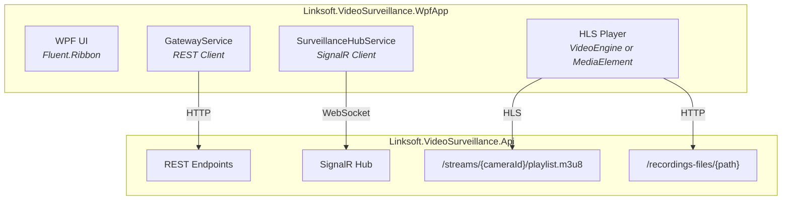

# Linksoft.VideoSurveillance Roadmap

## Linksoft.VideoSurveillance.WpfApp

A new WPF management application for the `Linksoft.VideoSurveillance.Api` server. Combines the management features of the existing Blazor WebAssembly UI with live multi-camera streaming and recording playback over HTTP.

### Motivation

The existing `Linksoft.Wpf.CameraWall.App` is a standalone desktop application that connects directly to cameras via RTSP/HTTP. The new `WpfApp` is a **client** for the REST API server, enabling:

- Centralized server-side camera management and recording
- Live camera streaming over HTTP/HLS from the server
- Remote management from any Windows machine on the network
- Recording playback streamed from the server's recording archive

### Architecture



### Project Structure

```
src/
└── Linksoft.VideoSurveillance.WpfApp/
    ├── Linksoft.VideoSurveillance.WpfApp.csproj  (net10.0-windows, WPF)
    ├── App.xaml / App.xaml.cs                     (Host, DI, Serilog)
    ├── MainWindow.xaml / MainWindow.xaml.cs        (Fluent.Ribbon shell)
    ├── Services/
    │   ├── GatewayService.cs                      (REST API client)
    │   ├── GatewayService.Cameras.cs
    │   ├── GatewayService.Layouts.cs
    │   ├── GatewayService.Recordings.cs
    │   ├── GatewayService.Settings.cs
    │   └── SurveillanceHubService.cs              (SignalR client)
    ├── ViewModels/
    │   ├── DashboardViewModel.cs
    │   ├── CamerasViewModel.cs
    │   ├── CameraFormViewModel.cs
    │   ├── LayoutsViewModel.cs
    │   ├── LiveViewModel.cs
    │   ├── RecordingsViewModel.cs
    │   └── SettingsViewModel.cs
    ├── Views/
    │   ├── DashboardView.xaml
    │   ├── CamerasView.xaml
    │   ├── CameraFormDialog.xaml
    │   ├── LayoutsView.xaml
    │   ├── LayoutEditorDialog.xaml
    │   ├── LiveView.xaml
    │   ├── RecordingsView.xaml
    │   └── SettingsDialog.xaml
    └── UserControls/
        ├── LiveCameraTile.xaml                     (HLS stream tile)
        ├── MotionBoundingBoxOverlay.xaml           (bounding box overlay)
        └── RecordingPlayer.xaml                    (HTTP playback)
```

### Dependencies

```
Linksoft.VideoSurveillance.WpfApp
├── Linksoft.VideoSurveillance.Core          (models, enums, settings)
├── Linksoft.VideoSurveillance.Api.Contracts (generated API client types)
├── Linksoft.VideoEngine                     (HLS playback via FFmpeg)
├── Linksoft.VideoEngine.DirectX             (GPU-accelerated rendering)
├── Linksoft.Wpf.VideoPlayer                 (VideoHost control for HLS)
├── Fluent.Ribbon                            (Ribbon UI)
├── Atc.XamlToolkit                          (MVVM source generators)
├── Atc.Wpf.Controls                         (UI controls)
├── Microsoft.AspNetCore.SignalR.Client       (real-time events)
├── Microsoft.Extensions.Hosting              (DI, configuration)
└── Serilog                                   (logging)
```

---

## Phase 1: Foundation

Core infrastructure and basic camera management.

### 1.1 Project Setup

- [ ] Create `Linksoft.VideoSurveillance.WpfApp` project (net10.0-windows, WPF)
- [ ] Configure `Microsoft.Extensions.Hosting` with DI container
- [ ] Configure Serilog with file sink (matching existing App patterns)
- [ ] Add Fluent.Ribbon `MainWindow` shell with tab structure
- [ ] Add configurable API base URL (via appsettings.json or connection dialog)
- [ ] Add project to `Linksoft.VideoSurveillance.slnx` solution

### 1.2 API Client Layer

- [ ] Implement `GatewayService` using `Atc.Rest.Client` and generated API contracts
- [ ] Camera endpoints: List, Create, Get, Update, Delete, Snapshot, Start/Stop Recording
- [ ] Layout endpoints: List, Create, Update, Delete, Apply
- [ ] Recording endpoints: List (with optional camera filter)
- [ ] Settings endpoints: Get, Update
- [ ] Add HTTP resilience handler (retry, timeout)
- [ ] Add error handling with user-friendly error messages

### 1.3 SignalR Client Layer

- [ ] Implement `SurveillanceHubService` connecting to `/hubs/surveillance`
- [ ] Handle `ConnectionStateChanged` events
- [ ] Handle `RecordingStateChanged` events
- [ ] Handle `MotionDetected` events with bounding box data
- [ ] Handle `StreamStarted` events with HLS playlist URLs
- [ ] Auto-reconnect with connection state tracking
- [ ] Connection status indicator in the Ribbon status bar

### 1.4 Dashboard View

- [ ] Real-time statistics: total cameras, connected count, active recordings, layout count
- [ ] Quick action buttons: Add Camera, Create Layout, Open Settings
- [ ] Server connection status indicator
- [ ] Auto-refresh via SignalR events

---

## Phase 2: Camera and Layout Management

Full CRUD operations matching BlazorApp feature parity.

### 2.1 Cameras View

- [ ] DataGrid listing all cameras (Name, IP, Port, Protocol, State, Recording)
- [ ] Connection state with color-coded indicators (connected = green, error = red, etc.)
- [ ] Real-time state updates via SignalR
- [ ] Toolbar buttons: Add, Edit, Delete, Snapshot, Start/Stop Recording
- [ ] Context menu on camera rows with all actions
- [ ] Snapshot capture with save-to-file dialog

### 2.2 Camera Form Dialog

- [ ] Expandable sections: Connection, Authentication, Display, Stream Settings
- [ ] Validation with error indicators (required fields, port range, etc.)
- [ ] Test Connection button (via API)
- [ ] Per-camera override tabs: Connection, Display, Performance, Motion Detection, Recording
- [ ] Override toggle pattern: "Use Master Settings" / "Override Locally"

### 2.3 Layouts View

- [ ] DataGrid listing all layouts (Name, Grid Size, Camera Count)
- [ ] Toolbar buttons: Create, Edit, Delete, Apply
- [ ] Set Startup Layout action

### 2.4 Layout Editor Dialog

- [ ] Grid configuration: Rows (1-8) and Columns (1-8)
- [ ] Dual-panel drag-drop editor:
  - Left panel: Available (unassigned) cameras
  - Right panel: Grid positions with assigned cameras
- [ ] Drag cameras between available and grid positions
- [ ] Save layout via API

---

## Phase 3: Live Multi-Camera Streaming

The key differentiating feature: live camera streaming from the server over HTTP/HLS.

### 3.1 HLS Stream Infrastructure

- [ ] Integrate `Linksoft.VideoEngine` for HLS playback (FFmpeg demux + decode)
- [ ] Use `Linksoft.Wpf.VideoPlayer.VideoHost` for GPU-accelerated rendering
- [ ] Handle `StreamStarted` SignalR events to receive HLS playlist URLs
- [ ] Start/Stop stream via SignalR hub invocation (`StartStream`, `StopStream`)
- [ ] Fallback to `MediaElement` for HLS if VideoEngine unavailable

### 3.2 Live View

- [ ] Layout selector dropdown (populated from API)
- [ ] Dynamic camera grid based on selected layout (rows x columns)
- [ ] `LiveCameraTile` UserControl per camera:
  - Camera name overlay
  - Connection status indicator
  - Start/Stop stream button
  - HLS video playback via VideoHost
  - Recording indicator
- [ ] Auto-start streams when layout is selected
- [ ] Grid resize handling with aspect ratio preservation

### 3.3 Motion Detection Visualization

- [ ] `MotionBoundingBoxOverlay` UserControl on each live tile
- [ ] Real-time bounding box rendering from SignalR `MotionDetected` events
- [ ] Coordinate mapping from analysis resolution to display resolution
- [ ] Smoothing algorithm for bounding box transitions (matching existing WPF implementation)
- [ ] Configurable color, thickness, and visibility per bounding box settings
- [ ] Motion indicator badge on camera tiles

### 3.4 Live View Context Menu

- [ ] Full screen (single camera, Escape to exit)
- [ ] Snapshot capture
- [ ] Start/Stop recording
- [ ] Start/Stop stream
- [ ] Edit camera
- [ ] Swap left/right positions

---

## Phase 4: Recordings Management

Browse, play, and download recordings streamed from the server.

### 4.1 Recordings View

- [ ] DataGrid listing recordings (Camera, File Path, Start Time, Duration, Size)
- [ ] Camera filter dropdown
- [ ] Date range filter
- [ ] Refresh button
- [ ] Real-time updates when `RecordingStateChanged` fires (new recording completed)

### 4.2 Recording Playback

- [ ] `RecordingPlayer` UserControl with HTTP video playback
- [ ] Stream recordings from server via `/recordings-files/{path}` endpoint
- [ ] Playback controls: Play, Pause, Seek, Volume
- [ ] Playback overlay showing filename and timestamp (per PlaybackOverlaySettings)
- [ ] Full-screen playback mode (matching `FullScreenRecordingWindow` pattern)

### 4.3 Recording Actions

- [ ] Play recording in embedded player
- [ ] Full-screen playback
- [ ] Download recording to local file (HTTP download with progress)
- [ ] Delete recording (with confirmation)

---

## Phase 5: Settings and Configuration

Comprehensive settings management matching the 7-tab Settings dialog.

### 5.1 Settings Dialog

- [ ] **General** tab: Theme (Dark/Light), Accent, Language, Startup behavior
- [ ] **Camera Display** tab: Overlay settings, Grid layout, Snapshot path
- [ ] **Connection** tab: Default protocol/port, Timeout, Reconnect, Notifications
- [ ] **Performance** tab: Video quality, Hardware acceleration, Buffer, RTSP transport
- [ ] **Motion Detection** tab: Sensitivity, Analysis resolution/FPS, Post-motion, Cooldown, Bounding box settings
- [ ] **Recording** tab: Path, Format, Segmentation, Timelapse, Cleanup, Playback overlay
- [ ] **Advanced** tab: Debug logging, Log path

### 5.2 Settings Persistence

- [ ] Load settings from API on dialog open (`GET /settings`)
- [ ] Save settings to API on dialog OK (`PUT /settings`)
- [ ] Per-section save support
- [ ] Revert/Cancel without saving

---

## Phase 6: Polish and Advanced Features

### 6.1 Connection Management

- [ ] Server connection dialog on startup (URL, optional auth)
- [ ] Remember last server URL
- [ ] Auto-reconnect to API on network recovery
- [ ] Connection status in Ribbon status bar
- [ ] Multiple server profiles (save/switch between servers)

### 6.2 Notifications

- [ ] Toast notifications for camera disconnect/reconnect events
- [ ] Toast notifications for motion detection events
- [ ] Toast notifications for recording start/stop
- [ ] Optional notification sounds (matching existing app behavior)
- [ ] Notification history panel

### 6.3 UI Enhancements

- [ ] Dark/Light theme support (applied from server settings)
- [ ] Multi-language support (loaded from server settings LCID)
- [ ] Keyboard shortcuts for common actions
- [ ] Ribbon quick access toolbar customization
- [ ] Window state persistence (size, position, maximized)

### 6.4 Aspire Integration

- [ ] Add `WpfApp` to Aspire orchestration as optional client
- [ ] Service discovery for API base URL
- [ ] Health check integration

---

## Phase Summary

| Phase | Focus | Key Deliverable |
|-------|-------|-----------------|
| **Phase 1** | Foundation | Project scaffold, API client, SignalR, Dashboard |
| **Phase 2** | Management | Camera CRUD, Layout editor, full BlazorApp parity |
| **Phase 3** | Live Streaming | Multi-camera HLS grid, motion visualization |
| **Phase 4** | Recordings | Browse, play, download server recordings |
| **Phase 5** | Settings | 7-tab settings dialog via API |
| **Phase 6** | Polish | Notifications, themes, connection management |

## Feature Comparison

| Feature | BlazorApp | WpfApp (planned) |
|---------|-----------|-------------------|
| Camera CRUD | Yes | Phase 2 |
| Layout management | Yes | Phase 2 |
| Layout drag-drop editor | Yes | Phase 2 |
| Dashboard with stats | Yes | Phase 1 |
| Settings (7 tabs) | Yes | Phase 5 |
| Live multi-camera grid | Yes (HLS.js) | Phase 3 (VideoEngine) |
| Motion bounding boxes | Yes (SVG overlay) | Phase 3 (WPF overlay) |
| Recording browser | Yes | Phase 4 |
| Recording playback | Yes (HTML5 video) | Phase 4 (VideoHost) |
| Recording download | Yes (JS interop) | Phase 4 (HTTP download) |
| Real-time SignalR events | Yes | Phase 1 |
| Dark/Light theme | Yes | Phase 6 |
| GPU-accelerated rendering | No (browser) | Phase 3 (D3D11VA) |
| Low-latency playback | No (HLS latency) | Phase 3 (VideoEngine) |
| Notification sounds | No | Phase 6 |
| Multiple server profiles | No | Phase 6 |
