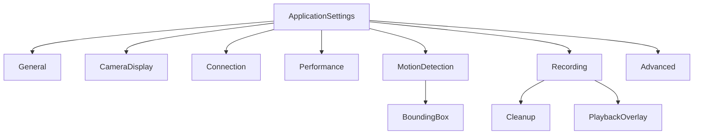

# Linksoft.VideoSurveillance Settings Reference

Complete reference for all application settings and parameters. Settings are stored as JSON in `%ProgramData%\Linksoft\CameraWall\settings.json` and are shared between the WPF desktop app and the REST API server.

## Settings Hierarchy



Settings support per-camera overrides via nullable override models. When a camera override is `null`, the application default is used. The `GetEffectiveValue()` method resolves the final value.

---

## General Settings

UI and startup behavior. **WPF only** (not exposed via API settings endpoint).

| Setting | Type | Default | Description |
|---------|------|---------|-------------|
| `ThemeBase` | string | `"Dark"` | Application theme: `"Dark"` or `"Light"` |
| `ThemeAccent` | string | `"Blue"` | Theme accent color name |
| `Language` | string | `"1033"` | LCID language code (1033 = en-US) |
| `ConnectCamerasOnStartup` | bool | `true` | Auto-connect all cameras on application start |
| `StartMaximized` | bool | `false` | Launch application in maximized window state |
| `StartRibbonCollapsed` | bool | `false` | Start with the Ribbon UI collapsed |

---

## Camera Display Settings

Camera overlay and grid layout defaults. Per-camera overrides available for overlay properties.

| Setting | Type | Default | Override | Description |
|---------|------|---------|----------|-------------|
| `ShowOverlayTitle` | bool | `true` | Yes | Display camera name in overlay |
| `ShowOverlayDescription` | bool | `true` | Yes | Display camera description in overlay |
| `ShowOverlayTime` | bool | `false` | Yes | Display current time in overlay |
| `ShowOverlayConnectionStatus` | bool | `true` | Yes | Display connection status indicator in overlay |
| `OverlayOpacity` | double | `0.7` | Yes | Overlay transparency (0.0 = transparent, 1.0 = opaque) |
| `OverlayPosition` | enum | `TopLeft` | No* | Default overlay position |
| `AllowDragAndDropReorder` | bool | `true` | No | Allow drag-and-drop camera reordering in grid |
| `AutoSaveLayoutChanges` | bool | `true` | No | Auto-save layout changes without prompting |
| `SnapshotPath` | string | `{ProgramData}\...\snapshots` | No | Default directory for camera snapshots |

*Overlay position is set per-camera in the camera's Display settings, not via the override system.

### Overlay Position Options

- `TopLeft` (default)
- `TopRight`
- `BottomLeft`
- `BottomRight`

---

## Connection Settings

Connection behavior, defaults for new cameras, and notification preferences.

| Setting | Type | Default | Override | Description |
|---------|------|---------|----------|-------------|
| `DefaultProtocol` | enum | `Rtsp` | No | Default protocol for new cameras |
| `DefaultPort` | int | `554` | No | Default port for new cameras |
| `ConnectionTimeoutSeconds` | int | `10` | Yes | Timeout in seconds for connection attempts |
| `ReconnectDelaySeconds` | int | `10` | Yes | Delay in seconds before reconnection attempt |
| `AutoReconnectOnFailure` | bool | `true` | Yes | Automatically reconnect on connection loss |
| `ShowNotificationOnDisconnect` | bool | `true` | Yes | Show notification when camera disconnects |
| `ShowNotificationOnReconnect` | bool | `false` | Yes | Show notification when camera reconnects |
| `PlayNotificationSound` | bool | `false` | Yes | Play audio alert on connectivity events |

### Camera Protocol Options

| Protocol | Default Port | Description |
|----------|-------------|-------------|
| `Rtsp` | 554 | Real Time Streaming Protocol |
| `Http` | 80 | HTTP streaming |
| `Https` | 443 | HTTPS streaming (secure) |

---

## Performance Settings

Video playback and streaming configuration.

| Setting | Type | Default | Override | Description |
|---------|------|---------|----------|-------------|
| `VideoQuality` | string | `"Auto"` | Yes | Target video resolution limit |
| `HardwareAcceleration` | bool | `true` | Yes | Use GPU acceleration (D3D11VA) for decoding |
| `LowLatencyMode` | bool | `false` | No | Enable low-latency streaming (reduces buffer) |
| `BufferDurationMs` | int | `500` | No | Video buffer duration in milliseconds |
| `RtspTransport` | string | `"tcp"` | No | RTSP transport protocol |
| `MaxLatencyMs` | int | `500` | No | Maximum acceptable latency in milliseconds |

### Video Quality Options

| Quality | Max Resolution | Description |
|---------|---------------|-------------|
| `Auto` | Source | No limit, use original quality |
| `1080p` | 1920x1080 | Full HD |
| `720p` | 1280x720 | HD |
| `480p` | 854x480 | Standard |
| `360p` | 640x360 | Low |

### RTSP Transport Options

| Transport | Description |
|-----------|-------------|
| `tcp` | Reliable, may have higher latency (default) |
| `udp` | Faster but less reliable, better for LAN |

---

## Motion Detection Settings

Frame-based motion analysis configuration. See [motion-detection.md](motion-detection.md) for detailed setup guide.

| Setting | Type | Default | Override | Description |
|---------|------|---------|----------|-------------|
| `Sensitivity` | int | `30` | Yes | Detection threshold (0-100, higher = more sensitive) |
| `MinimumChangePercent` | double | `0.5` | Yes | Minimum % of frame change to trigger detection |
| `AnalysisFrameRate` | int | `30` | Yes | Frames per second for motion analysis (clamped 2-15) |
| `AnalysisWidth` | int | `800` | Yes | Width of analysis frame in pixels |
| `AnalysisHeight` | int | `600` | Yes | Height of analysis frame in pixels |
| `PostMotionDurationSeconds` | int | `10` | Yes | Seconds to continue reporting motion after it stops |
| `CooldownSeconds` | int | `5` | Yes | Minimum seconds between motion-triggered recordings |
| `BoundingBox` | object | *(see below)* | Yes | Bounding box visualization settings |

### Bounding Box Settings

| Setting | Type | Default | Override | Description |
|---------|------|---------|----------|-------------|
| `ShowInGrid` | bool | `false` | Yes | Display bounding boxes in camera grid view |
| `ShowInFullScreen` | bool | `false` | Yes | Display bounding boxes in full-screen view |
| `Color` | string | `"Red"` | Yes | Box color (named color: Red, Green, Blue, Cyan, Yellow, etc.) |
| `Thickness` | int | `2` | Yes | Line thickness in pixels (1-10) |
| `MinArea` | int | `10` | Yes | Minimum area in pixels to display a box (filters noise) |
| `Padding` | int | `4` | No | Padding around detected motion regions in pixels |
| `Smoothing` | double | `0.3` | Yes | Smoothing factor for box transitions (0.0-1.0) |

---

## Recording Settings

Recording paths, formats, segmentation, and timelapse configuration.

| Setting | Type | Default | Override | Description |
|---------|------|---------|----------|-------------|
| `RecordingPath` | string | `{ProgramData}\...\recordings` | Yes | Directory for storing recordings |
| `RecordingFormat` | string | `"mkv"` | Yes | Container format for recordings |
| `TranscodeVideoCodec` | enum | `None` | Yes | Video codec for transcoding |
| `EnableRecordingOnMotion` | bool | `false` | Yes | Auto-record when motion is detected |
| `EnableRecordingOnConnect` | bool | `false` | Yes | Auto-record when camera connects |
| `EnableHourlySegmentation` | bool | `true` | No | Split recordings into clock-aligned segments |
| `MaxRecordingDurationMinutes` | int | `60` | No | Maximum segment length in minutes |
| `ThumbnailTileCount` | int | `4` | Yes | Thumbnail grid: 1 (single 320x240) or 4 (2x2 640x480) |
| `EnableTimelapse` | bool | `false` | Yes | Enable interval-based timelapse snapshots |
| `TimelapseInterval` | string | `"5m"` | Yes | Timelapse capture interval |
| `Cleanup` | object | *(see below)* | No | Media cleanup settings |
| `PlaybackOverlay` | object | *(see below)* | No | Playback overlay settings |

### Recording Format Options

| Format | Description |
|--------|-------------|
| `mkv` | Matroska container (default, better codec support) |
| `mp4` | MPEG-4 container (wider playback compatibility) |

### Transcode Codec Options

| Codec | Description |
|-------|-------------|
| `None` | Copy original stream (fastest, no re-encoding) |
| `H264` | Transcode to H.264 (slower, guaranteed compatibility) |

### Timelapse Interval Options

`10s`, `30s`, `1m`, `5m` (default), `10m`, `30m`, `1h`, `3h`, `6h`, `12h`, `24h`

### Recording Segmentation

When `EnableHourlySegmentation` is enabled, recordings are split at clock-aligned boundaries. For example, with `MaxRecordingDurationMinutes = 60`, files are segmented at :00 each hour. With 15 minutes, segments occur at :00, :15, :30, :45.

### Media Cleanup Settings

| Setting | Type | Default | Description |
|---------|------|---------|-------------|
| `Schedule` | enum | `Disabled` | When to run cleanup |
| `RecordingRetentionDays` | int | `30` | Keep recordings for this many days |
| `IncludeSnapshots` | bool | `false` | Also clean up old snapshots |
| `SnapshotRetentionDays` | int | `7` | Keep snapshots for this many days |

#### Cleanup Schedule Options

| Schedule | Description |
|----------|-------------|
| `Disabled` | No automatic cleanup (default) |
| `OnStartup` | Clean up when application starts |
| `OnStartupAndPeriodically` | Clean up on startup and every 6 hours |

### Playback Overlay Settings

| Setting | Type | Default | Description |
|---------|------|---------|-------------|
| `ShowFilename` | bool | `true` | Display recording filename during playback |
| `FilenameColor` | string | `"White"` | Color of filename text |
| `ShowTimestamp` | bool | `true` | Display current timestamp during playback |
| `TimestampColor` | string | `"White"` | Color of timestamp text |

---

## Advanced Settings

Debugging and logging configuration.

| Setting | Type | Default | Description |
|---------|------|---------|-------------|
| `EnableDebugLogging` | bool | `false` | Enable verbose logging to file |
| `LogPath` | string | `{ProgramData}\...\logs` | Directory for log files |

When debug logging is enabled:
- **WPF App**: Logs to `{LogPath}\camera-wall-{date}.log`
- **API Server**: Logs to `{LogPath}\video-surveillance-api-{date}.log`
- Both use daily rolling with 7-day retention

---

## Per-Camera Configuration

In addition to the override system, each camera has its own direct configuration properties.

### Connection Settings (per camera)

| Setting | Type | Default | Description |
|---------|------|---------|-------------|
| `IpAddress` | string | *(required)* | Camera IP address or hostname |
| `Protocol` | enum | `Rtsp` | Streaming protocol |
| `Port` | int | `554` | Streaming port (1-65535) |
| `Path` | string | `null` | Optional stream path (e.g., `/stream`) |

### Authentication Settings (per camera)

| Setting | Type | Default | Description |
|---------|------|---------|-------------|
| `UserName` | string | `null` | Username for camera authentication |
| `Password` | string | `null` | Password for camera authentication |

### Display Settings (per camera)

| Setting | Type | Default | Description |
|---------|------|---------|-------------|
| `DisplayName` | string | *(required)* | Human-readable camera name (max 256 chars) |
| `Description` | string | `null` | Optional camera description |
| `OverlayPosition` | enum | `TopLeft` | Overlay position for this camera |

### Stream Settings (per camera)

| Setting | Type | Default | Description |
|---------|------|---------|-------------|
| `UseLowLatencyMode` | bool | `true` | Enable low-latency streaming |
| `MaxLatencyMs` | int | `500` | Maximum acceptable latency (ms) |
| `RtspTransport` | string | `"tcp"` | Transport protocol: tcp, udp |
| `BufferDurationMs` | int | `0` | Buffer duration (ms) |

---

## Per-Camera Override System

Every application-level setting marked "Override: Yes" in the tables above can be overridden on a per-camera basis. Override models use nullable properties where `null` means "use application default".

```
CameraOverrides
├── Connection (ConnectionOverrides)
│   ├── ConnectionTimeoutSeconds?
│   ├── ReconnectDelaySeconds?
│   ├── AutoReconnectOnFailure?
│   ├── ShowNotificationOnDisconnect?
│   ├── ShowNotificationOnReconnect?
│   └── PlayNotificationSound?
├── CameraDisplay (CameraDisplayOverrides)
│   ├── ShowOverlayTitle?
│   ├── ShowOverlayDescription?
│   ├── ShowOverlayTime?
│   ├── ShowOverlayConnectionStatus?
│   └── OverlayOpacity?
├── Performance (PerformanceOverrides)
│   ├── VideoQuality?
│   └── HardwareAcceleration?
├── Recording (RecordingOverrides)
│   ├── RecordingPath?
│   ├── RecordingFormat?
│   ├── TranscodeVideoCodec?
│   ├── EnableRecordingOnMotion?
│   ├── EnableRecordingOnConnect?
│   ├── ThumbnailTileCount?
│   ├── EnableTimelapse?
│   └── TimelapseInterval?
└── MotionDetection (MotionDetectionOverrides)
    ├── Sensitivity?
    ├── MinimumChangePercent?
    ├── AnalysisFrameRate?
    ├── AnalysisWidth?
    ├── AnalysisHeight?
    ├── PostMotionDurationSeconds?
    ├── CooldownSeconds?
    └── BoundingBox (BoundingBoxOverrides)
        ├── ShowInGrid?
        ├── ShowInFullScreen?
        ├── Color?
        ├── Thickness?
        ├── Smoothing?
        └── MinArea?
```

### Resolving Effective Values

Use `IApplicationSettingsService.GetEffectiveValue()` to resolve per-camera overrides against application defaults:

```csharp
var timeout = settingsService.GetEffectiveValue(
    camera,
    settingsService.Connection.ConnectionTimeoutSeconds,
    o => o?.Connection?.ConnectionTimeoutSeconds);
```

---

## API Server Settings

The REST API exposes settings via endpoints:

- `GET /settings` - Retrieve current application settings
- `PUT /settings` - Update application settings

The API returns and accepts the full `ApplicationSettings` structure (General, CameraDisplay, Connection, Performance, MotionDetection, Recording, Advanced).

Per-camera overrides are managed through camera endpoints:
- `PUT /cameras/{cameraId}` - Update camera with overrides in the request body

---

## Application Paths

All default paths are relative to `%ProgramData%\Linksoft\CameraWall\`:

| Path | Purpose |
|------|---------|
| `cameras.json` | Camera configurations and layouts |
| `settings.json` | Application settings |
| `logs/` | Debug log files |
| `snapshots/` | Camera snapshots and timelapse frames |
| `recordings/` | Video recordings with thumbnails |

---

## JSON Example

```json
{
  "general": {
    "themeBase": "Dark",
    "themeAccent": "Blue",
    "language": "1033",
    "connectCamerasOnStartup": true,
    "startMaximized": false,
    "startRibbonCollapsed": false
  },
  "cameraDisplay": {
    "showOverlayTitle": true,
    "showOverlayDescription": true,
    "showOverlayTime": false,
    "showOverlayConnectionStatus": true,
    "overlayOpacity": 0.7,
    "overlayPosition": "topLeft",
    "allowDragAndDropReorder": true,
    "autoSaveLayoutChanges": true,
    "snapshotPath": "C:\\ProgramData\\Linksoft\\CameraWall\\snapshots"
  },
  "connection": {
    "defaultProtocol": "rtsp",
    "defaultPort": 554,
    "connectionTimeoutSeconds": 10,
    "reconnectDelaySeconds": 10,
    "autoReconnectOnFailure": true,
    "showNotificationOnDisconnect": true,
    "showNotificationOnReconnect": false,
    "playNotificationSound": false
  },
  "performance": {
    "videoQuality": "Auto",
    "hardwareAcceleration": true,
    "lowLatencyMode": false,
    "bufferDurationMs": 500,
    "rtspTransport": "tcp",
    "maxLatencyMs": 500
  },
  "motionDetection": {
    "sensitivity": 30,
    "minimumChangePercent": 0.5,
    "analysisFrameRate": 30,
    "analysisWidth": 800,
    "analysisHeight": 600,
    "postMotionDurationSeconds": 10,
    "cooldownSeconds": 5,
    "boundingBox": {
      "showInGrid": false,
      "showInFullScreen": false,
      "color": "Red",
      "thickness": 2,
      "minArea": 10,
      "padding": 4,
      "smoothing": 0.3
    }
  },
  "recording": {
    "recordingPath": "C:\\ProgramData\\Linksoft\\CameraWall\\recordings",
    "recordingFormat": "mkv",
    "transcodeVideoCodec": "none",
    "enableRecordingOnMotion": false,
    "enableRecordingOnConnect": false,
    "enableHourlySegmentation": true,
    "maxRecordingDurationMinutes": 60,
    "thumbnailTileCount": 4,
    "enableTimelapse": false,
    "timelapseInterval": "5m",
    "cleanup": {
      "schedule": "disabled",
      "recordingRetentionDays": 30,
      "includeSnapshots": false,
      "snapshotRetentionDays": 7
    },
    "playbackOverlay": {
      "showFilename": true,
      "filenameColor": "White",
      "showTimestamp": true,
      "timestampColor": "White"
    }
  },
  "advanced": {
    "enableDebugLogging": false,
    "logPath": "C:\\ProgramData\\Linksoft\\CameraWall\\logs"
  }
}
```
